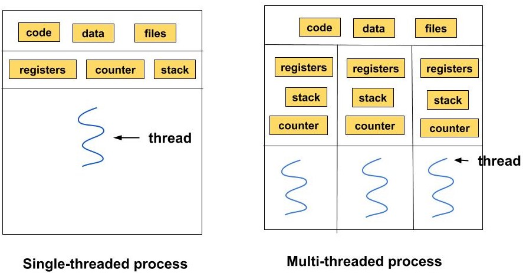

# Process and Thread Management
---
## What is a Process?

A process is an instance of a computer program that is being executed. It's a self-contained execution environment with its own memory space, which includes the program code, data, and other resources like open files and network connections. Each time you launch an application (like a web browser or a text editor), you are creating at least one process.

Key characteristics of a process:

- **Independent:** Processes are isolated from each other. One process cannot directly access the memory or resources of another.
    
- **Heavyweight:** Creating a process consumes a significant amount of system resources (memory, CPU time) because the operating system has to allocate a dedicated memory space and data structures for it.
    
- **Resource Ownership:** A process owns resources such as memory, file handles, and devices.
    
---
## Process States

A process moves through different states during its life cycle. The operating system's scheduler manages these transitions.

```
graph TD
    Dormant(Dormant / Created) --> Ready;
    Ready <--> Running;
    Running --> Waiting;
    Waiting --> Ready;
    Running --> Terminated;
```

Here is a detailed explanation of each state:

- **Dormant (Created):** This is the initial state where the process is first created (e.g., by a `fork()` call). The operating system has allocated resources, but the process has not yet been approved to compete for CPU time.
    
- **Ready:** The process is loaded into main memory and is ready to run. It is waiting for the CPU to be assigned to it by the scheduler. There can be many processes in the "Ready" state at one time.
    
- **Running:** The process's instructions are being executed by the CPU. A process moves from the "Ready" state to the "Running" state when the scheduler picks it.
    
- **Waiting (Blocked):** The process is waiting for some event to occur, such as the completion of an I/O operation (like reading from a file) or receiving a signal. It cannot proceed until this event happens. Once the event is complete, the process moves back to the "Ready" state, not directly to "Running."
    
- **Terminated (Finished):** The process has finished its execution or has been explicitly killed. Its resources are reclaimed by the operating system.
    
---
## Key Process Concepts

Beyond the basic lifecycle, several key concepts define how processes interact:

**1. Snapshot Behavior (fork())** When the `fork()` system call is made, a new child process is created. This child process receives a _snapshot_ of the parent's memory, file descriptors, and execution state at that exact moment. From that point on, both the parent and child processes continue to execute independently.

```
// Demo: fork() Snapshot Behavior
// Demonstrates that parent and child are separate processes
// with their own copies of variables after the fork.
#include <stdio.h>
#include <unistd.h>
#include <sys/types.h>
#include <sys/wait.h>

int main() {
    int shared_var = 10;
    pid_t pid = fork();

    if (pid < 0) {
        perror("Fork failed");
        return 1;
    } else if (pid == 0) {
        // Child process
        printf("CHILD: I am the child process.\n");
        shared_var = 20; // Change my copy
        printf("CHILD: My PID is %d, my parent's PID is %d\n", getpid(), getppid());
        printf("CHILD: shared_var = %d\n", shared_var);
    } else {
        // Parent process
        sleep(1); // Let child run first
        printf("PARENT: I am the parent process.\n");
        printf("PARENT: My PID is %d, my child's PID is %d\n", getpid(), pid);
        printf("PARENT: shared_var = %d (Unaffected by child)\n", shared_var);
        wait(NULL); // Clean up child
    }
   return 0;
}
```

**2. Process Trees** Processes can form hierarchical structures known as **process trees**, where a parent process can have multiple child processes, each of which can have their own children, and so on. This structure is useful for organizing related processes and managing complex tasks.

**3. Zombie Process** A **zombie process** occurs when a child process has terminated, but the parent process has not yet called `wait()` to read its exit status. Zombies occupy an entry in the process table until the parent acknowledges their termination.

```
// Demo: Handling Zombie Processes
// This demo shows how zombie processes are created when the parent process
// does not call wait() to clean up terminated child processes.
#include <stdio.h>
#include <unistd.h>
#include <sys/types.h>

int main() {
    pid_t pid = fork();

    if (pid < 0) {
        perror("Fork failed");
        return 1;
    } else if (pid == 0) {
        // Child process
        printf("Child Process: PID = %d\n", getpid());
        return 0; // Terminate immediately
    } else {
        // Parent process
        printf("Parent Process: PID = %d, Child PID = %d\n", getpid(), pid);
        printf("Parent Process: Sleeping for 30 seconds without calling wait().\n");
        sleep(30); // During this time, the child becomes a zombie
        printf("Parent Process: Exiting now. Zombie should be cleaned up by parent (or init).\n");
    }
    return 0;
}
```

**4. Orphan Process** An **orphan process** is a child process whose parent has terminated before it. Orphan processes are adopted by the `init` process (PID 1), which ensures they are properly cleaned up when they eventually terminate (by calling `wait()` on them).

```
// Demo: Orphan Process
// Demonstrates an orphan process being adopted by 'init' (or equivalent).
#include <stdio.h>
#include <unistd.h>
#include <sys/types.h>
#include <stdlib.h>

int main() {
    pid_t pid = fork();

    if (pid < 0) {
        perror("Fork failed");
        return 1;
    } else if (pid == 0) {
        // Child process
        printf("CHILD: I am the child, my PID is %d\n", getpid());
        printf("CHILD: My parent's PID is %d\n", getppid());
        sleep(5); // Give parent time to exit
        printf("CHILD: Parent has exited. My new parent PID is %d (adopted by init/systemd)\n", getppid());
        exit(0);
    } else {
        // Parent process
        printf("PARENT: I am the parent, my PID is %d\n", getpid());
        printf("PARENT: My child's PID is %d\n", pid);
        printf("PARENT: Exiting now, before my child.\n");
    }
   return 0;
}
```

**5. Concurrency vs. Parallelism**

- **Concurrency** involves multiple processes making progress simultaneously by time-sharing CPU resources.
    
- **Parallelism** involves multiple processes running _truly_ simultaneously on multi-core systems.
    

**6. Signal Handling** Processes can communicate and control each other using **signals**. Common signals include `SIGCHLD` (sent when a child process terminates) and `SIGKILL` (forcefully terminates a process).

**7. Daemon vs. Background vs. Zombie Processes** Understanding the distinctions between these process types is crucial for managing a Linux system.

---

| Aspect                        | Daemon Process                                                                                      | Background Process                                                                          | Zombie Process                                                                                                                             |
| ----------------------------- | --------------------------------------------------------------------------------------------------- | ------------------------------------------------------------------------------------------- | ------------------------------------------------------------------------------------------------------------------------------------------ |
| **Definition**                | A fully detached, service-oriented process that runs continuously without user interaction.         | A process running in the background, typically started by a user within a terminal session. | A terminated process that has completed execution but still has an entry in the process table awaiting the parent to read its exit status. |
| **Parent Process**            | Typically `init` or `systemd` (PID 1) as the parent process.                                        | User's shell or terminal session.                                                           | Original parent process that hasn't reaped the child.                                                                                      |
| **Lifecycle**                 | Runs indefinitely until stopped or the system shuts down.                                           | Ends if the terminal is closed or the user logs out, unless disowned.                       | Brief existence until the parent process collects its exit status.                                                                         |
| **Purpose**                   | Provides ongoing services or handles specific tasks continuously.                                   | Allows users to perform tasks without blocking the terminal.                                | Allows the parent process to obtain the child's exit status.                                                                               |
| **Control**                   | Not directly controllable via job control; managed through service management tools like `systemd`. | Can be brought back to the foreground or terminated by the user.                            | Managed implicitly by the parent process; if not handled, zombies accumulate.                                                              |
| **Process Group and Session** | Detached into its own session and process group.                                                    | Belongs to the user's session and process group.                                            | Part of the parent's process group and session until reaped.                                                                               |
| **File Descriptor Handling**  | Closes or redirects all standard file descriptors to detach from the terminal.                      | Typically inherits file descriptors from the shell; may still interact with the terminal.   | Inherits file descriptors from the parent; does not interact with terminal as it's terminated.                                             |
| **Startup Method**            | Started automatically at boot time or on-demand by system services.                                 | Initiated manually by the user using commands with `&`.                                     | Occurs automatically when a child process terminates without being reaped by the parent.                                                   |
| **Resource Usage**            | Designed to be efficient, consuming minimal CPU and memory resources unless performing tasks.       | Varies based on the task; generally user-initiated tasks that might consume resources.      | Minimal (only a process table entry); however, many zombies can exhaust the process table.                                                 |

---
## List of Signals

You can list all available signals on your system by using the `kill -l` command:

```
kill -l
```

Below is a comprehensive list of signals available in Linux, including their signal numbers, names, default actions, and descriptions.

**Standard Signals**

|Signal Number|Signal Name|Default Action|Description|
|---|---|---|---|
|1|SIGHUP|Terminate|Hangup detected on controlling terminal or death of controlling process. Often used to reload configuration files.|
|2|SIGINT|Terminate|Interrupt from keyboard (Ctrl+C).|
|3|SIGQUIT|Core Dump & Terminate|Quit from keyboard (Ctrl+). Creates a core dump.|
|4|SIGILL|Core Dump & Terminate|Illegal Instruction.|
|5|SIGTRAP|Core Dump & Terminate|Trace/breakpoint trap.|
|6|SIGABRT|Core Dump & Terminate|Abort signal from `abort()`.|
|7|SIGBUS|Core Dump & Terminate|Bus error (accessing memory incorrectly).|
|8|SIGFPE|Core Dump & Terminate|Floating-point exception.|
|9|SIGKILL|Terminate|Kill signal. Cannot be caught or ignored.|
|10|SIGUSR1|Terminate|User-defined signal 1.|
|11|SIGSEGV|Core Dump & Terminate|Invalid memory reference (segmentation fault).|
|12|SIGUSR2|Terminate|User-defined signal 2.|
|13|SIGPIPE|Terminate|Broken pipe: write to pipe with no readers.|
|14|SIGALRM|Terminate|Timer signal from `alarm()`.|
|15|SIGTERM|Terminate|Termination signal. Used to politely ask a process to terminate.|
|17|SIGCHLD|Ignore|Child process terminated or stopped.|
|18|SIGCONT|Continue|Continue if stopped.|
|19|SIGSTOP|Stop|Stop process. Cannot be caught or ignored.|
|20|SIGTSTP|Stop|Stop typed at terminal (Ctrl+Z).|
|21|SIGTTIN|Stop|Background process attempting read.|
|22|SIGTTOU|Stop|Background process attempting write.|
|23|SIGURG|Ignore|Urgent condition on socket.|
|24|SIGXCPU|Terminate|CPU time limit exceeded.|
|25|SIGXFSZ|Terminate|File size limit exceeded.|
|26|SIGVTALRM|Terminate|Virtual alarm clock.|
|27|SIGPROF|Terminate|Profiling timer expired.|
|28|SIGWINCH|Ignore|Window size change.|
|29|SIGIO|Terminate|I/O now possible.|
|30|SIGPWR|Terminate|Power failure imminent.|
|31|SIGSYS|Core Dump & Terminate|Bad system call.|

**Real-Time Signals**

Real-time signals are numbered from 32 to 64 and are intended for application-defined purposes. They have the following properties:

- **Guaranteed Delivery:** Signals are not lost; they are queued.
    
- **Ordered Delivery:** Signals are delivered in the order they were sent.
    

|Signal Number|Signal Name|Default Action|Description|
|---|---|---|---|
|34-64|SIGRTMIN to SIGRTMAX|Terminate|Real-time user-defined signals.|

_Note: The exact numbering of real-time signals can vary between different Unix-like systems._

---
### Sending Signals

#### Using the `kill` Command

Despite its name, the `kill` command is used to send signals to processes, not just to terminate them.

**Syntax:**

```
kill -SIGNAL PID
```

**Examples:**

```
# Gracefully terminate a process:
kill -SIGTERM 1234

# Forcefully kill a process:
kill -SIGKILL 1234

# Send a user-defined signal:
kill -SIGUSR1 1234
```

#### Using the `killall` Command

The `killall` command sends signals to all processes running a specified command.

**Syntax:**

```
killall -SIGNAL process_name
```

**Examples:**

```
# Gracefully terminate all instances of firefox:
killall -SIGTERM firefox

# Forcefully kill all instances of firefox:
killall -SIGKILL firefox
```

#### Using the `pkill` Command

The `pkill` command sends signals to processes based on various criteria such as name, user, group, etc.

**Syntax:**

```
pkill -SIGNAL pattern
```

**Examples:**

```
# Terminate all processes matching the pattern vim:
pkill -SIGTERM vim

# Send SIGUSR1 to all processes owned by user john:
pkill -SIGUSR1 -u john
```

---
## Background and Foreground Processes

In a command-line shell (like `bash`), you can control whether a process runs in the **foreground** (where it takes over your terminal) or the **background** (where it runs without blocking you).

- **Foreground (fg):** This is the default. The process runs, and you cannot type new commands until it finishes or is suspended.
    
- **Background (bg):** The process runs "behind the scenes." You immediately get your command prompt back and can run other commands.
    

Here are the common commands to manage this:

```
# Run a process in the background
# The '&' symbol tells the shell to run this process in the background.
sleep 50 &

# See the status of background (and suspended) processes
jobs

# Bring a background process to the foreground
# This will bring the job with ID %1 to the foreground.
fg %1

# --- Suspending and Resuming ---

# While a process is in the foreground, press `Ctrl+Z`
# This sends a "suspend" signal (SIGTSTP), pausing the process.
# (This is different from Ctrl+C, which sends a "terminate" signal)

# After suspending (Ctrl+Z), the process is stopped.
# You can see it listed in `jobs` as "Stopped".

# To make the stopped process run in the background
bg %1
```

---
## Process Priority (Nice Value)

The **priority** (`PRI`) of a process is its actual execution priority, managed by the kernel's scheduler. This value is not directly changeable by a normal user.

The **nice value** (`NI`) is a user-adjustable setting that influences the priority. A higher nice value means a _lower_ priority (the process is "nicer" to other processes).

- Values range from `-20` (highest priority) to `19` (lowest priority).
    
- Regular users can only _increase_ the nice value (lower the priority) of their own processes.
    

You can launch a process with a specific nice value:

```
# Runs 'sleep 123456' with a nice value of 10 (lower priority)
nice -n 10 sleep 123456
```

To see the priority and nice values of processes:

```
# ps -elf shows all processes with full details
# The 'PRI' column is the priority
# The 'NI' column is the nice value
ps -elf | grep sleep
```

---
## What is a Thread?

A thread is the smallest unit of execution within a process. A process can have multiple threads running concurrently, all sharing the same memory space and resources of that parent process. Threads are often called "lightweight processes." For example, in a word processor, one thread might handle user input, another might check for spelling errors in the background, and a third could be saving the document periodically.

Key characteristics of a thread:

- **Dependent:** Threads exist within a process and share its resources (memory, code, files).
    
- **Lightweight:** Threads are faster to create and require fewer resources than processes because they don't need a new memory space allocated.
    
- **Shared Resources:** All threads of a process share its code, data, and open files. However, each thread has its own stack, registers, and program counter.
    
---
## Communication

How these units of execution talk to each other is a fundamental concept that stems directly from their design.

### Inter-Process Communication (IPC)

Because processes are isolated in their own separate memory spaces, they cannot communicate directly. They require the operating system to act as an intermediary. This method, while safer, is inherently slower. Common IPC mechanisms include:

- **Pipes:** A channel where one process can write information and another can read it.
    
- **Sockets:** Allows processes to communicate over a network, not just on the same machine.
    
- **Shared Memory:** The operating system allocates a block of memory that both processes have permission to access.
    
- **Message Queues:** A list of messages that processes can add to and read from.
    

### Inter-Thread Communication

Threads have a much simpler and faster way to communicate. Since all threads within a process share the same memory, they can communicate directly by reading and writing to the same data and variables.

- **Direct Access:** One thread can modify a piece of data, and all other threads within that process can immediately see the change.
    
- **Synchronization Challenge:** The major risk with this method is a **race condition**, where multiple threads attempt to modify the same resource simultaneously, leading to corrupted data. To prevent this, programmers use synchronization tools like **mutexes** and **semaphores** to ensure only one thread can access a critical section of data at a time.


---
## Differences Between Process and Thread

The main distinction is that processes are independent and heavyweight, while threads are dependent (part of a process) and lightweight. Threads within the same process share memory, which allows for easy communication but can also lead to synchronization issues. Processes have separate memory spaces, making communication more complex (requiring mechanisms like pipes or sockets) but providing better security and stability.

### Visualizing the Difference

The image below illustrates this concept perfectly.

- **On the left (Single-Threaded Process):** You see one large box representing the process's memory. It contains the shared `code`, `data`, `files`. There is only one thread of execution, which has its own private `registers`, `stack`, and `program counter`.
    
- **On the right (Multi-Threaded Process):** This is still a single process in one large box. The `code`, `data`, `files` are still shared across the entire process. However, there are now multiple threads running inside it. Crucially, while they share the process's resources, **each thread has its own separate `registers`, `stack`, and `program counter`**.
    

This visual highlights why threads are "lightweight." To create a new thread, the system only needs to create a new set of registers, a stack, and a counter, reusing the existing code and data. To create a whole new process, it would need to duplicate the entire box.

### Comparison Table

| Feature               | Process                                                                                   | Thread                                                                          |
| --------------------- | ----------------------------------------------------------------------------------------- | ------------------------------------------------------------------------------- |
| **Weight**            | Heavyweight                                                                               | Lightweight                                                                     |
| **Memory**            | Each process has its own separate memory space.                                           | Threads share the memory space of their parent process.                         |
| **Creation Time**     | Takes more time to create.                                                                | Takes less time to create.                                                      |
| **Communication**     | Communication between processes (Inter-Process Communication) is slower and more complex. | Communication between threads is faster and simpler as they share memory.       |
| **Context Switching** | Slower, as the OS has to manage separate memory maps.                                     | Faster, as they share the same memory space.                                    |
| **Isolation**         | Processes are isolated from each other. If one process fails, it does not affect others.  | Threads are not isolated. If one thread fails, it can crash the entire process. |
| **Resource Sharing**  | Resources are not shared between processes by default.                                    | Code, data, and files are shared among all threads in a process.                |
| **Example**           | Opening multiple instances of a web browser.                                              | Having multiple tabs open within a single web browser window.                   |