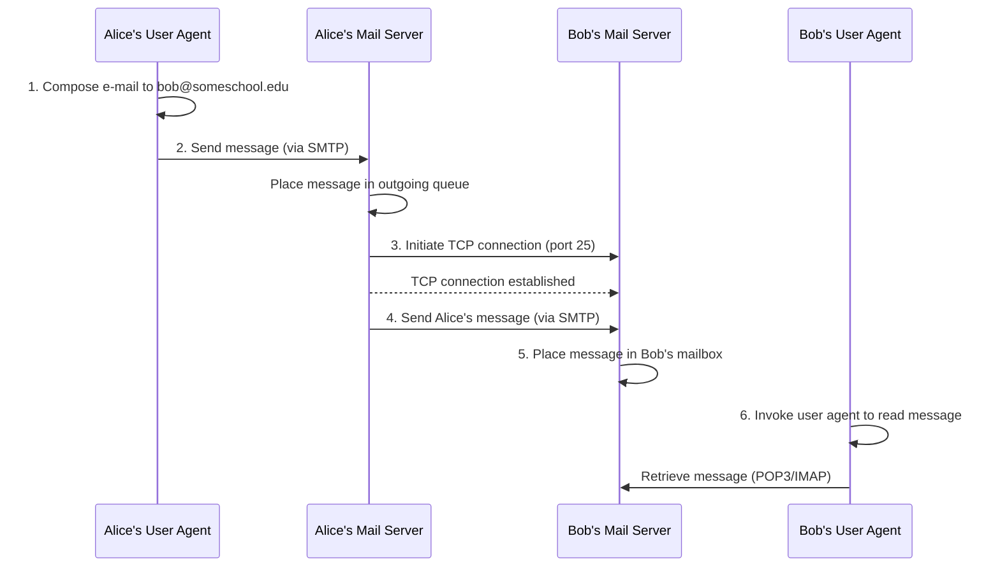
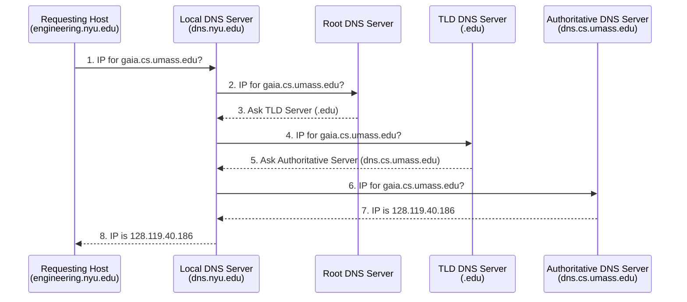

# Session 10 : Introduction to Networking & The Application Layer

This document provides a basic overview of computer networking concepts and the application layer.

---
## Part 1: Introduction to Networking

- **What is a Network?** The basic idea of connecting two or more devices to share resources (like files, printers, or an internet connection).
    
- **Core Components:**
    
    - **Clients & Servers:** Devices that request information vs. devices that provide it.
        
    - **Routers:** Devices that forward data _between_ different networks.
        
    - **Switches:** Devices that forward data _within_ a single network.
        
- **Network Models:** Network models provide a framework for understanding how different networking tasks are handled in layers. The two most common models are:
    
    - **TCP/IP (Internet Protocol) Stack:** This is the practical model that the internet is built on. It's often shown as a 5-layer stack:
        
        - **5. Application:** Supports network applications. Protocols include **HTTP, IMAP, SMTP, DNS**. The data unit at this layer is called a **Message**. (See Part 2 for more details).
            
        - **4. Transport:** Responsible for process-to-process data transfer. Key protocols are **TCP** (reliable, connection-oriented) and **UDP** (unreliable, connectionless). The data unit is called a **Segment** (for TCP) or **Datagram** (for UDP).
            
        - **3. Network:** Handles the routing of data (datagrams) from the source to the destination across multiple networks. The main protocol is **IP** (Internet Protocol). The data unit is called a **Packet**.
            
        - **2. Link:** Manages data transfer between neighboring network elements (e.g., from your computer to your router). Examples include **Ethernet, 802.11 (WiFi), and PPP**. The data unit is called a **Frame**.
            
        - **1. Physical:** Deals with the physical transmission of "bits on the wire" (e.g., electrical signals, radio waves, light pulses). The data unit is a **Bit**.
            
    - **OSI Model:** A theoretical 7-layer model that is often used for teaching and troubleshooting. It is more granular than the TCP/IP model.
        
- **TCP/IP vs. OSI Model Comparison:** While the 5-layer TCP/IP model is used in practice, the 7-layer OSI model is excellent for theory and troubleshooting. Here's how they compare:
    

|7-Layer OSI Model|5-Layer TCP/IP Model|Purpose|
|---|---|---|
|**7. Application**|\multirow{3}{*}{**5. Application**}|Provides services directly to user applications (e.g., HTTP, DNS).|
|**6. Presentation**||Formats and encrypts data (e.g., SSL/TLS, JPEG). Handled by the application in the TCP/IP model.|
|**5. Session**||Manages communication "sessions" between applications. Handled by the application in the TCP/IP model.|
|**4. Transport**|**4. Transport**|Provides reliable (TCP) or unreliable (UDP) data transfer between processes.|
|**3. Network**|**3. Network**|Handles logical addressing (IP) and routing between networks.|
|**2. Data Link**|**2. Link**|Manages physical addressing (MAC) and data transfer on the local network.|
|**1. Physical**|**1. Physical**|Transmits raw bits over the physical medium (wires, fiber, radio).|

- **Encapsulation & Data Flow:** **Encapsulation** is the process of taking data from a higher layer and "wrapping" it with a header (and sometimes a trailer) at the next lower layer. This is how a `Message` becomes a `Segment`, then a `Packet`, then a `Frame`.
    
    As data moves through the network, different devices process it up to different layers:
    
    - **Source (Your PC):** Creates a `Message` at the Application layer and encapsulates it all a way down to `Bits` at the Physical layer.
        
    - **Switch (Link Layer Device):** A switch operates _within_ a local network. It receives `Bits` (Layer 1) and processes data up to the **Link Layer** (Layer 2). It reads the `Frame` to see the _MAC address_ (a local hardware address) and forwards the frame to the correct device on the same network (like the router).
        
    - **Router (Network Layer Device):** A router connects _different_ networks. It receives `Bits` (Layer 1), processes the `Frame` (Layer 2), and processes the `Packet` (Layer 3). It reads the `Packet` to see the final _IP address_ (the global address) to decide which network to send the packet to next. It then creates a _new_ frame to send the packet on its next "hop."
        
    - **Destination (Server):** The data arrives. The destination computer does the reverse process, called **de-encapsulation**. It strips off the headers at each layer, moving the data up the stack (Bits -> Frame -> Packet -> Segment) until the original `Message` is delivered to the correct application.
        
    
    Here's a visual representation of the encapsulation process:
    
    ```mermaid
   graph TD
    subgraph Source["Source PC"]
        A["Application Layer: Message (M)"] --> B["Transport Layer: Segment/Datagram (Ht + M)"]
        B --> C["Network Layer: Packet (Hn + Ht + M)"]
        C --> D["Link Layer: Frame (Hl + Hn + Ht + M + Tl)"]
        D --> E["Physical Layer: Bits"]
    end

    E --> F["Switch (Link Layer)"]
    F --> G["Router (Network Layer)"]
    G --> H["Destination PC"]

    subgraph Destination["Destination PC"]
        H --> I["Physical Layer: Bits"]
        I --> J["Link Layer: Frame (De-encapsulate Hl)"]
        J --> K["Network Layer: Packet (De-encapsulate Hn)"]
        K --> L["Transport Layer: Segment/Datagram (De-encapsulate Ht)"]
        L --> M["Application Layer: Original Message"]
    end
    ```
    
- **Key Concepts:**
    
    - **IP Address:** The unique "mailing address" for a device on a network (e.g., `192.168.1.10`), used at the **Network Layer**.
        
    - **Port Number:** The specific "door" for a particular service at that address (e.g., port `80` for web traffic), used at the **Transport Layer**.
        
    - **DNS (Domain Name System):** The service that translates human-readable names (like `google.com`) into computer-readable IP addresses, operating at the **Application Layer**.
        

---
## Part 2: The Application Layer

- **Purpose:** This is the top layer (Layer 5 in the TCP/IP model) that applications, like your web browser or email client, directly use to talk to the network.
    
- **What an Application-Layer Protocol Defines:** An application-layer protocol provides the rules and formats that applications use to exchange messages. It defines:
    
    - **Types of messages exchanged:** What kinds of interactions are possible (e.g., a "request" from a client, a "response" from a server).
        
    - **Message syntax:** The structure of messages, including what fields are present and how they are delimited (e.g., how the URL, headers, and body are separated in an HTTP request).
        
    - **Message semantics:** The meaning of the information within those fields (e.g., what a `200 OK` status code means in HTTP).
        
    - **Rules for when and how processes send & respond to messages:** The sequence of operations (e.g., a client sends a request, then waits for a response).
        
    
    **Types of Protocols:**
    
    - **Open Protocols:**
        
        - Defined in **RFCs (Requests For Comments)**, making their definitions publicly accessible.
            
        - Allow for **interoperability**, meaning different software and hardware implementations can communicate seamlessly.
            
        - **Examples:** HTTP, SMTP, DNS.
            
    - **Proprietary Protocols:**
        
        - Owned and controlled by a specific company or organization.
            
        - May not be publicly documented, limiting interoperability to specific products.
            
        - **Examples:** Some aspects of Skype, Zoom communication protocols.
            

### The Transport Layer: Logical Communication

Before an application can use a protocol like HTTP or SMTP, it needs a way to send its messages to the other computer. This is the job of the **Transport Layer**.

- It provides a **logical communication** between _application processes_ running on different hosts.
    
- This means that from the application's perspective, it's as if the two processes (e.g., your browser and the web server) are directly connected. This is a "logical" connection because, in reality, the data is passing through many physical routers and networks.
    
- Transport protocols act only in the **end systems** (the sender and receiver), not in the intermediate routers.
    
- **Sender:** Breaks the application _messages_ into smaller **segments** and passes them to the Network Layer.
    
- **Receiver:** Reassembles the _segments_ back into the original _messages_ and passes them up to the Application Layer.
    
- The two main transport protocols available are **TCP** and **UDP**.
    
- **Application Needs & Transport Services:** Different applications have different needs, which determines what kind of service they require from the **Transport Layer** (like TCP or UDP).
    
    - **Data Integrity (Reliability):**
        
        - **High Need:** Some apps, like file transfers or web transactions, require 100% reliable data transfer. No data can be lost. (Uses **TCP**).
            
        - **Tolerant:** Other apps, like streaming audio or video, can tolerate some data loss without failing. (Often uses **UDP**).
            
    - **Throughput (Bandwidth):**
        
        - **Minimum Required:** Some apps, like multimedia streaming, need a minimum amount of throughput (e.g., 2 Mbps) to be effective.
            
        - **Elastic:** Other apps, called "elastic apps" (like email or file transfer), will make use of whatever throughput they can get.
            
    - **Timing (Latency):**
        
        - **Low-Latency Required:** Some apps, like internet telephony (VoIP) or interactive games, require low delay (low latency) to be effective. (Often uses **UDP**).
            
    - **Security:**
        
        - Many applications require security services, such as encryption and data integrity, which can be provided by protocols like **TLS** (which runs on top of TCP).
            
---
### Transport Protocol Services (TCP vs. UDP)

Based on the needs above, an application will use one of the two main transport protocols.

#### TCP Service

Provides a reliable service for applications that need it. Its key features are:

- **Reliable transport:** Guarantees that data sent from the sending process will be delivered completely and in order to the receiving process.
    
- **Flow control:** Ensures the sender won't overwhelm the receiver with too much data at once.
    
- **Congestion control:** Throttles the sender when the network itself is overloaded to prevent packet loss.
    
- **Connection-oriented:** A setup process (the "three-way handshake") is required between the client and server before any data can be sent.
    
- **Does NOT provide:** Guarantees on timing or minimum throughput. It also does not (by default) provide security, which is why we use HTTPS (HTTP + TLS/SSL) instead of just HTTP.
    

#### UDP Service

Provides a simple, no-frills service for applications that prize speed and low overhead over reliability.

- **Unreliable data transfer:** Provides no guarantees. Data can be lost, arrive out of order, or be duplicated.
    
- **Does NOT provide:** Reliability, flow control, congestion control, timing guarantees, throughput guarantees, security, or connection setup.
    
---
### Web and HTTP

The **World Wide Web** is a core application that runs on the internet.

- A **web page** consists of **objects**. An object can be an HTML file, a JPEG image, a Java applet, an audio file, etc.
    
- A **web page** has a **base HTML-file** which includes several **referenced objects**.
    
- Each object is addressable by a **URL (Uniform Resource Locator)**.
    
- A URL has two main parts:
    
    - **Host name:** (e.g., `www.someschool.edu`) The server where the resource lives.
        
    - **Path name:** (e.g., `/someDept/pic.gif`) The specific location of the resource on that server.
        

#### HTTP Messages

HTTP (Hypertext Transfer Protocol) is the protocol of the web. It uses two main types of messages: `request` and `response`.

- **HTTP Request Message:**
    
    - This is the message sent _by the client_ (e.g., your browser) to a web server.
        
    - It is sent in **ASCII (human-readable format)**.
        
    - The message consists of one or more lines:
        
        1. **Request Line:** The first line, which has three parts:
            
            - **Method:** The command, such as `GET` (to request a page), `POST` (to submit data), or `HEAD` (to ask for info about a page).
                
            - **URL:** The path to the resource (e.g., `/index.html`).
                
            - **Version:** The protocol version (e.g., `HTTP/1.1`).
                
        2. **Header Lines:** Zero or more lines that provide additional information to the server.
            
            - `Host:` The domain name of the server (required in HTTP/1.1).
                
            - `User-Agent:` Information about the browser sending the request.
                
            - `Accept-Language:` What languages the client prefers.
                
            - `Connection:` Can be used to request a persistent connection (`keep-alive`).
                
        3. **End of Headers:** A blank line (just `\r\n`) signals the end of the header lines.
            
        4. **(Optional) Body:** For `POST` messages, the data being submitted (e.g., from a form) follows the blank line.
            
    - **Example of a full HTTP `GET` request:**
        
        ```bash
        GET /index.html HTTP/1.1\r\n
        Host: www-net.cs.umass.edu\r\n
        User-Agent: Mozilla/5.0 (Macintosh; Intel Mac OS X 10.15; rv:80.0) Gecko/20100101 Firefox/80.0\r\n
        Accept: text/html,application/xhtml+xml\r\n
        Accept-Language: en-us,en;q=0.5\r\n
        Connection: keep-alive\r\n
        \r\n
        ```
        
- **Common Protocols:**
    
    - **HTTP/HTTPS:** The foundation of the World Wide Web.
        
    - **DNS:** The "phonebook" of the internet.
        
    - **DHCP:** How devices automatically get an IP address.
        
    - **SMTP, POP3, IMAP:** Protocols for sending and receiving email.
        
    - **FTP/SFTP:** Used for transferring files.
        
    - **SSH (Secure Shell):** Used for securely logging into remote computers.
        
---
## Part 3: Common Network Diagnostic Tools

Here are two essential command-line tools for checking network connections.

### `ping`

The `ping` command is the most basic tool to check if a host is reachable and how long it takes for a packet to get to it and back (latency).

**Use Case:** To check if you have an internet connection or if a specific server (like Google) is online.

**Command:**

```
ping [www.google.com](https://www.google.com)
```

**What it does:**

- It sends a small data packet (called an ICMP Echo Request) to `www.google.com`.
    
- If the server receives it, it sends a reply back.
    
- You will see the time it took for each round trip, measured in milliseconds (ms). This helps you know if your connection is fast or slow.
    
- If it fails, you might see "Request timed out" or "Unknown host," indicating a problem.
    

### `traceroute`

The `traceroute` command (or `tracert` on Windows) shows you the complete path or "route" that your packets take to get to a destination. It lists all the routers (or "hops") your data jumps through along a way.

**Use Case:** To find out _where_ a connection is- failing or slowing down.

**Command:** _(Note: On some systems, it might require `sudo` to run, but try without it first.)_

```
traceroute [www.google.com](https://www.google.com)
```

**Example Output & Interpretation:**

```
traceroute to [www.google.com](https://www.google.com) (142.251.36.68), 30 hops max, 60 byte packets
 1  10.58.80.79 (10.58.80.79)   5.044 ms   5.026 ms   5.017 ms
 2  192.168.0.1 (192.168.0.1)   12.690 ms   12.682 ms   12.672 ms
 3  * * *
 4  * * *
 5  * * *
 6  * * *
 7  * * *
 8  * * *
 9  * * *
10  * * *
11  * * *
12  hu-0-0-0-5.br03.mrs01.as3491.net (63.222.61.125)   88.706 ms
...
22  prg03s10-in-f4.1e100.net (142.251.36.68)   487.743 ms   487.739 ms   489.769 ms
```

**How to read this:**

- Each numbered line is one "hop" (usually a router).
    
- **`10.58.80.79`**: This is the first hop, likely your computer's gateway.
    
- **`192.168.0.1`**: This is the second hop, probably your home router.
    
- **`* * *`**: As you noted, this means the router at that hop (hops 3-11) did not send a response back. This is very common; many routers are configured to ignore `traceroute` packets for security or performance reasons. It doesn't necessarily mean the route is broken.
    
- **`...`**: The packet continues to jump from router to router across the internet.
    
- **`prg03s10-in-f4.1e100.net (142.251.36.68)`**: This is the final hop, the server at Google that responded.
    

### `nslookup`

The `nslookup` command (which stands for "name server lookup") is used to query the Domain Name System (DNS) to find the IP address for a specific domain name, or vice-versa.

**Use Case:** To find the IP address of a website (e.g., `google.com`) or to find the domain name associated with an IP address.

**Command:**

```
nslookup google.com
```

**What it does:**

- It contacts your default DNS server (usually your router or your ISP's server).
    
- It asks the DNS server for the IP address (specifically, the "A record") associated with the name `google.com`.
    
- The server looks it up in its database (or asks other servers) and sends back the answer.
    

**Example Output:**

```
Server:  1.1.1.1
Address: 1.1.1.1#53

Non-authoritative answer:
Name:    google.com
Address: 142.251.36.14
Name:    google.com
Address: 2a00:1450:4001:82b::200e
```

- **`Server` / `Address`:** This is the DNS server that answered your query.
    
- **`Non-authoritative answer:`** This means the server didn't own the original record but had a copy (cache) of it.
    
- **`Name: google.com` / `Address: 142.251.36.14`**: This is the IPv4 address for Google.
    
- **`Name: google.com` / `Address: 2a00:1450:4001:82b::200e`**: This is the IPv6 address for Google.
    


---
# Session 11: Application Layer and Transport layer

### Transport Layer: Multiplexing and Demultiplexing

A host (like a server or your computer) can run many different network applications at the same time (e.g., a web server, an email server, a game). The Transport Layer is responsible for making sure data from the network gets to the _correct application_.

- **Socket:** An application process (like `P1` or `P2` in the diagram) uses a "door" called a **socket** to send and receive data from the Transport Layer.
    
- **Demultiplexing (at the Receiver):** This is the job of delivering received data to the correct socket. The transport layer on the receiving machine (the server in the middle) gets an incoming segment from the network. It looks at the segment's **header info** (specifically, the **destination port number**) to determine which socket (and thus which application process, `P1` or `P2`) to deliver the data to.
    
- **Multiplexing (at the Sender):** This is the process of gathering data chunks from different sockets (e.g., from `P3` and `P4` on the client machines), encapsulating them with a header (which includes the _source_ and _destination_ port numbers), and passing the segments down to the Network Layer.
    

#### Connectionless Demultiplexing (UDP)

- For **UDP**, demultiplexing is simple. A UDP socket is identified only by its **destination port number**.
    
- When a UDP datagram arrives, the host looks _only_ at the `dest port number` in the header to know which socket (application) to deliver it to.
    
- This means that multiple clients sending data to the _same_ destination port (e.g., a DNS server on port 53) will all have their data routed to the _same_ socket on the server.
    

#### Connection-Oriented Demultiplexing (TCP)

This is how demultiplexing works for **TCP**, which is connection-oriented.

- A TCP socket is uniquely identified by a **4-tuple**:
    
    1. **Source IP address**
        
    2. **Source port number**
        
    3. **Destination IP address**
        
    4. **Destination port number**
        
- **Demux:** The receiver (e.g., a web server) uses **all four values** in this 4-tuple to direct an incoming segment to the appropriate socket.
    
- This is how a single server can support many simultaneous TCP connections (e.g., many different clients browsing the same website at the same time).
    
- Each socket is associated with a different connecting client, and the 4-tuple (which includes the client's unique source IP and source port) is what allows the server to keep all the connections separate.
    

#### Multiplexing/Demultiplexing Summary

- **Multiplexing / Demultiplexing** is a general concept based on **segment/datagram header field values**.
    
- **UDP** uses only the **destination port number**.
    
- **TCP** uses the **4-tuple** (source/dest IP, source/dest port).
    
- **Note:** This concept of multiplexing/demultiplexing (using header fields to direct data) happens at _all_ layers of the network stack, not just the transport layer. For example, the Link Layer uses MAC addresses, and the Network Layer uses IP addresses to direct data.
    
---
### E-mail

The E-mail system is a major application-layer service with three main components: User Agents, Mail Servers, and SMTP.

- **User Agents:**
    
    - This is the software that the user interacts with, also known as a "mail reader" or mail client.
        
    - Used for composing, editing, and reading mail messages.
        
    - Examples include Microsoft Outlook, iPhone mail client, or a web client like Gmail.
        
    - It interacts with the mail server to retrieve incoming messages (from the user mailbox) and send outgoing messages.
        
- **Mail Servers:**
    
    - These are the backend servers that do the heavy lifting.
        
    - **Mailbox:** Contains incoming messages for the user.
        
    - **Message Queue:** Contains outgoing (to-be-sent) mail messages.
        
    - These servers use the SMTP protocol to send email messages to each other. In this interaction:
        
        - The **"client"** is the _sending_ mail server.
            
        - The **"server"** is the _receiving_ mail server.
            
- **Simple Mail Transfer Protocol (SMTP):**
    
    - This is the protocol (defined in **RFC 5321**) used to _push_ email from one mail server to another, and also from a user agent to its mail server.
        
    - As the diagram shows, SMTP is the protocol that mail servers use to communicate with each other to transfer email.
        
    
    **SMTP Details:**
    
    - It uses **TCP** on **port 25** to reliably transfer email messages.
        
    - The transfer is **direct**: the sending server (acting as a client) initiates a TCP connection directly to the receiving server.
        
    - **Three phases of transfer:**
        
        1. **SMTP Handshaking (greeting):** The client and server introduce themselves (e.g., `HELO` command, `250 Hello` response).
            
        2. **SMTP Transfer of Messages:** The client sends the actual email message (headers and body).
            
        3. **SMTP Closure:** The connection is terminated.
            
    - It is a **command/response** interaction, similar to HTTP.
        
        - **Commands:** Sent from the client in ASCII text (e.g., `HELO`, `MAIL FROM:`, `RCPT TO:`, `DATA`).
            
        - **Response:** Sent from the server as a status code and phrase (e.g., `250 OK`, `220 Service ready`).
            
    
    **Example SMTP Interaction:** This example shows the three phases in action (`C:` is the client, `S:` is the server). The first part (`HELO` to `RCPT TO`) is the **handshaking**. The `DATA` section is the **message transfer**. The `QUIT` is the **closure**.
    
    ```bash
    S: 220 hamburger.edu
    C: HELO crepes.fr
    S: 250 Hello crepes.fr, pleased to meet you
    C: MAIL FROM: <alice@crepes.fr>
    S: 250 alice@crepes.fr... Sender ok
    C: RCPT TO: <bob@hamburger.edu>
    S: 250 bob@hamburger.edu ... Recipient ok
    C: DATA
    S: 354 Enter mail, end with "." on a line by itself
    C: Do you like ketchup?
    C: How about pickles?
    C: .
    S: 250 Message accepted for delivery
    C: QUIT
    S: 221 hamburger.edu closing connection
    ```
    
---
### Example Scenario: Alice sends e-mail to Bob

This scenario shows how all the components work together to send a message.

1. Alice uses her User Agent (UA) to compose an e-mail message "to" `bob@someschool.edu`.
    
2. Alice's UA sends the message to her mail server using SMTP; the message is placed in her server's outgoing message queue.
    
3. The client side of SMTP on Alice's mail server opens a TCP connection with Bob's mail server (on port 25).
    
4. The SMTP client (Alice's server) sends Alice's message over the established TCP connection.
    
5. Bob's mail server receives the message and places it in Bob's mailbox.
    
6. Bob invokes his user agent (at his convenience) to read the message (which retrieves it from his mail server).
    



---
### DNS: A Distributed, Hierarchical Database

The Domain Name System (DNS) is a critical application-layer protocol that acts as the "phonebook of the internet."

- **The Problem:** Internet hosts (like computers and servers) use numerical **IP addresses** (e.g., `142.251.36.14`) to find each other. Humans, however, find it much easier to remember **names** (e.g., `google.com`).
    
- **The Solution (DNS):** DNS is the system that maps between these IP addresses and names (and vice-versa).
    
- **Key Characteristics:**
    
    - It is a **distributed database** implemented in a hierarchy of many "name servers" all over the world.
        
    - It is an **application-layer protocol** that hosts and DNS servers use to communicate and "resolve" names (translate a name to an IP address).
        
    - Even though it's a core internet function, it's implemented at the "edge" (as an application) rather than in the network core.
        

#### DNS Resource Records (RR)

The distributed database is composed of **Resource Records (RR)**.

- **RR Format:** `(name, value, type, ttl)`
    
    - **`ttl` (Time To Live):** How long a DNS resolver should cache (store) this record before asking for it again.
        
- **Common Record Types:**
    
    - **`type=A`**:
        
        - `name`: The hostname (e.g., `www.google.com`).
            
        - `value`: The IP address (e.g., `142.251.36.14`). This is the **A Record** used in web browsing.
            
    - **`type=NS`**:
        
        - `name`: The domain (e.g., `google.com`).
            
        - `value`: The hostname of an **Authoritative Name Server** for that domain (e.g., `ns1.google.com`). This is used to delegate control.
            
    - **`type=CNAME`**:
        
        - `name`: An alias name (e.g., `www.ibm.com`).
            
        - `value`: The "canonical" (real) name (e.g., `servereast.backup2.ibm.com`).
            
    - **`type=MX`**:
        
        - `name`: The domain (e.g., `asu.eng.edu.eg`).
            
        - `value`: The name of the SMTP **Mail Exchange** server associated with that domain (e.g., `mx.asu.eng.edu.eg`). This is the **MX Record** used in email.
            

The hierarchy consists of:

1. **Root DNS Servers:** The very top of the hierarchy. They don't know the IP for `www.amazon.com`, but they know where to find the `.com` DNS servers (using an `NS` record).
    
2. **Top-Level Domain (TLD) DNS Servers:** These servers handle top-level domains like `.com`, `.org`, `.edu`, and also country-specific domains like `.eg` (Egypt) or `.uk` (United Kingdom). They know where to find the authoritative servers for `amazon.com` or `asu.eng.edu.eg`.
    
3. **Authoritative DNS Servers:** This is the organization's (e.g., Amazon, Google, Ain Shams University) own DNS server. It holds the actual records (like `A` records for IP addresses or `MX` records for mail) for that domain.
    

#### Example 1: Finding a Web Server (A Record)

A client wants the IP address for `www.amazon.com`. This is called an **A Record** query.

1. The client queries a **Root Server** to find a `.com` DNS server.
    
2. The client queries the **`.com` TLD Server** to get the `amazon.com` DNS server.
    
3. The client queries the **`amazon.com` Authoritative Server** to get the IP address for `www.amazon.com`.
    

#### Example 2: Finding a Mail Server (MX Record)

This is your question. Alice's mail server wants to send an email to `mahmoud.a.rouf@asu.eng.edu.eg`.

**Important:** The server is **not** looking for an IP address for `mahmoud.a.rouf`. It is looking for the **mail server** for the domain `@asu.eng.edu.eg`. It does this by querying for an **MX (Mail Exchange) record**.

The process is a more complex version of the first example:

1. The client's DNS resolver queries a **Root Server** to find the `.eg` DNS server.
    
2. The client queries the **`.eg` TLD Server** to find the `edu.eg` DNS server.
    
3. The client queries the **`edu.eg` Server** to find the `eng.edu.eg` DNS server.
    
4. The client queries the **`eng.edu.eg` Server** to find the **Authoritative Server** for `asu.eng.edu.eg`.
    
5. The client queries the **`asu.eng.edu.eg` Authoritative Server** and asks, "What is the **MX record** for this domain?"
    
6. The authoritative server responds with the name of that domain's mail server (e.g., `mx.asu.eng.edu.eg`).
    
7. The client must then perform a _new_ DNS lookup (an **A record** query, as in Example 1) for `mx.asu.eng.edu.eg` to get its final IP address.
    
8. Once Alice's mail server has this IP address, it can open the SMTP connection (as described in the e-mail section) to that IP.
    

#### DNS Query Types: Iterated Query

The process described in the examples above is called an **Iterated Query**. This is the standard way DNS resolution works.

- **Iterated Query:** The contacted server (e.g., the Root server) replies with the name of the _next_ server to contact. The local DNS server must then _iterate_ this process, contacting each server in the chain itself (Root -> TLD -> Authoritative).
    
- **The server's response is:** "I don't know this name, but ask this _other_ server."
    
- **The "work"** of finding the name is done by the client's **local DNS server**.
    

**Example:** A host at `engineering.nyu.edu` wants the IP address for `gaia.cs.umass.edu`.

1. The **Requesting Host** asks its **Local DNS Server** (`dns.nyu.edu`).
    
2. The **Local DNS Server** asks a **Root Server**.
    
3. The **Root Server** replies, "I don't know, but ask the `.edu` TLD Server."
    
4. The **Local DNS Server** asks the **`.edu` TLD Server**.
    
5. The **TLD Server** replies, "I don't know, but ask the `dns.cs.umass.edu` Authoritative Server."
    
6. The **Local DNS Server** asks the **`dns.cs.umass.edu` Authoritative Server**.
    
7. The **Authoritative Server** replies with the IP address for `gaia.cs.umass.edu`.
    
8. The **Local DNS Server** sends the final IP address back to the **Requesting Host**.
    

Here is a diagram of this iterated query flow:



#### DNS Protocol Messages

DNS query and reply messages both use the same format, which is broken into several sections. The most important is the **message header**.

- **Message Header (12 bytes):**
    
    - **Identification (16 bits):** A 16-bit number that identifies the query. The reply to a query _must_ use the same identification number so the client can match the response to the original request.
        
    - **Flags (16 bits):** A set of bits that specify details about the message:
        
        - **Query or Reply (1 bit):** Indicates if the message is a query (0) or a reply (1).
            
        - **Recursion Desired (1 bit):** Set by the client if it wants the DNS server to perform the full query (a recursive query).
            
        - **Recursion Available (1 bit):** Set in the reply if the server supports recursive queries.
            
        - **Reply is Authoritative (1 bit):** Set in the reply if the server that answered is the authoritative server for the domain.
            
- **Questions:** The question(s) being asked (e.g., "What is the `A` record for `www.google.com`?").
    
- **Answers:** The Resource Records that answer the question.
    
- **Authority:** Resource Records pointing to authoritative servers.
    
- **Additional Info:** Other helpful records (e.g., the IP address of a mail server listed in an `MX` record).
    

---
### P2P File Distribution: BitTorrent

BitTorrent is a popular application-layer protocol for **P2P (peer-to-peer)** file distribution. Unlike a client-server model (where one server sends the file to everyone), in P2P, the peers (users) download the file from _each other_.

In BitTorrent, a file is broken into many small **chunks** (e.g., 256KB each). Peers in the "swarm" (all peers involved with a specific file) exchange these chunks.

#### Requesting Chunks

A peer (let's call her Alice) needs to decide which chunks to download first.

- At any given time, different peers in the swarm will have different subsets of the file chunks.
    
- Periodically, Alice asks each of her connected peers for a list of the chunks they have.
    
- Alice's strategy is to request her missing chunks **"rarest first"**.
    
    - She identifies which of her missing chunks are the _least common_ among her peers.
        
    - By requesting the rarest chunks first, she increases the availability of that chunk in the swarm, which helps the overall health and speed of the download for everyone.
        

#### Sending Chunks (Tit-for-Tat)

Alice also needs to decide which peers to _upload_ (send) chunks to. This is based on a "tit-for-tat" strategy.

- Alice prioritizes sending chunks to the peers who are sending _her_ chunks at the highest rate.
    
- She maintains a "top 4" list of peers that are providing her the best download speed. She actively sends chunks to these four peers.
    
- Other peers are "choked," meaning she does not send them any chunks (though they may still be sending to her).
    
- She re-evaluates this "top 4" list every 10 seconds.
    
- Every 30 seconds, she also "optimistically unchokes" one other random peer (a peer not in her top 4) and starts sending them chunks.
    
    - This is done to "discover" if this peer could provide a better upload rate and potentially earn a spot in her top 4.
        
    - This also ensures new peers can get their first chunks and join the swarm.
        
---
# Session 12: Network Layer Data Plane