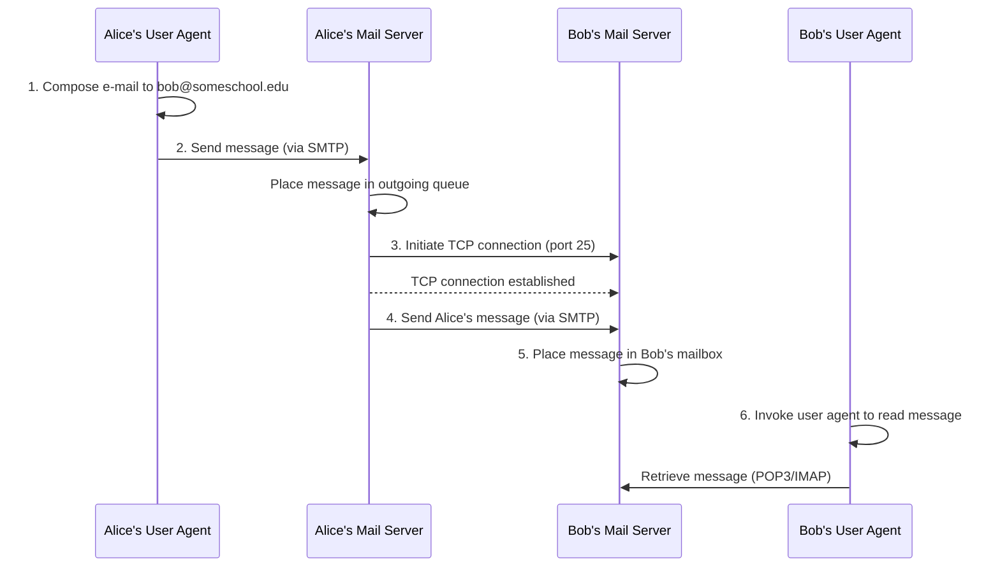
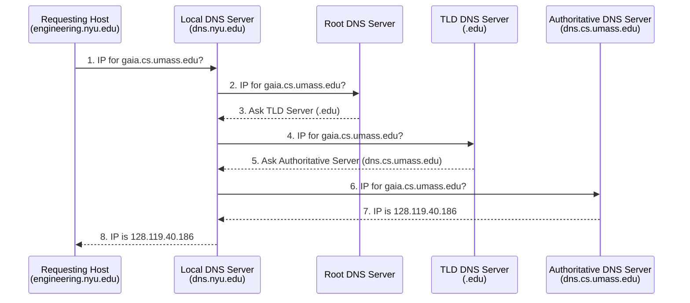
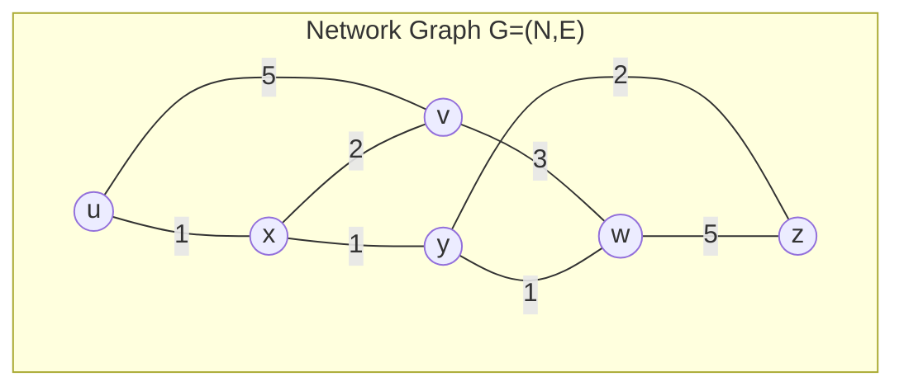

# Session 10 : Introduction to Networking & The Application Layer

This document provides a basic overview of computer networking concepts and the application layer.

---
## Part 1: Introduction to Networking

- **What is a Network?** The basic idea of connecting two or more devices to share resources (like files, printers, or an internet connection).
    
- **Core Components:**
    
    - **Clients & Servers:** Devices that request information vs. devices that provide it.
        
    - **Routers:** Devices that forward data _between_ different networks.
        
    - **Switches:** Devices that forward data _within_ a single network.
        
- **Network Models:** Network models provide a framework for understanding how different networking tasks are handled in layers. The two most common models are:
    
    - **TCP/IP (Internet Protocol) Stack:** This is the practical model that the internet is built on. It's often shown as a 5-layer stack:
        
        - **5. Application:** Supports network applications. Protocols include **HTTP, IMAP, SMTP, DNS**. The data unit at this layer is called a **Message**. (See Part 2 for more details).
            
        - **4. Transport:** Responsible for process-to-process data transfer. Key protocols are **TCP** (reliable, connection-oriented) and **UDP** (unreliable, connectionless). The data unit is called a **Segment** (for TCP) or **Datagram** (for UDP).
            
        - **3. Network:** Handles the routing of data (datagrams) from the source to the destination across multiple networks. The main protocol is **IP** (Internet Protocol). The data unit is called a **Packet**.
            
        - **2. Link:** Manages data transfer between neighboring network elements (e.g., from your computer to your router). Examples include **Ethernet, 802.11 (WiFi), and PPP**. The data unit is called a **Frame**.
            
        - **1. Physical:** Deals with the physical transmission of "bits on the wire" (e.g., electrical signals, radio waves, light pulses). The data unit is a **Bit**.
            
    - **OSI Model:** A theoretical 7-layer model that is often used for teaching and troubleshooting. It is more granular than the TCP/IP model.
        
- **TCP/IP vs. OSI Model Comparison:** While the 5-layer TCP/IP model is used in practice, the 7-layer OSI model is excellent for theory and troubleshooting. Here's how they compare:
    

|7-Layer OSI Model|5-Layer TCP/IP Model|Purpose|
|---|---|---|
|**7. Application**|\multirow{3}{*}{**5. Application**}|Provides services directly to user applications (e.g., HTTP, DNS).|
|**6. Presentation**||Formats and encrypts data (e.g., SSL/TLS, JPEG). Handled by the application in the TCP/IP model.|
|**5. Session**||Manages communication "sessions" between applications. Handled by the application in the TCP/IP model.|
|**4. Transport**|**4. Transport**|Provides reliable (TCP) or unreliable (UDP) data transfer between processes.|
|**3. Network**|**3. Network**|Handles logical addressing (IP) and routing between networks.|
|**2. Data Link**|**2. Link**|Manages physical addressing (MAC) and data transfer on the local network.|
|**1. Physical**|**1. Physical**|Transmits raw bits over the physical medium (wires, fiber, radio).|

- **Encapsulation & Data Flow:** **Encapsulation** is the process of taking data from a higher layer and "wrapping" it with a header (and sometimes a trailer) at the next lower layer. This is how a `Message` becomes a `Segment`, then a `Packet`, then a `Frame`.
    
    As data moves through the network, different devices process it up to different layers:
    
    - **Source (Your PC):** Creates a `Message` at the Application layer and encapsulates it all a way down to `Bits` at the Physical layer.
        
    - **Switch (Link Layer Device):** A switch operates _within_ a local network. It receives `Bits` (Layer 1) and processes data up to the **Link Layer** (Layer 2). It reads the `Frame` to see the _MAC address_ (a local hardware address) and forwards the frame to the correct device on the same network (like the router).
        
    - **Router (Network Layer Device):** A router connects _different_ networks. It receives `Bits` (Layer 1), processes the `Frame` (Layer 2), and processes the `Packet` (Layer 3). It reads the `Packet` to see the final _IP address_ (the global address) to decide which network to send the packet to next. It then creates a _new_ frame to send the packet on its next "hop."
        
    - **Destination (Server):** The data arrives. The destination computer does the reverse process, called **de-encapsulation**. It strips off the headers at each layer, moving the data up the stack (Bits -> Frame -> Packet -> Segment) until the original `Message` is delivered to the correct application.
        
    
    Here's a visual representation of the encapsulation process:
    
    ```mermaid
   graph TD
    subgraph Source["Source PC"]
        A["Application Layer: Message (M)"] --> B["Transport Layer: Segment/Datagram (Ht + M)"]
        B --> C["Network Layer: Packet (Hn + Ht + M)"]
        C --> D["Link Layer: Frame (Hl + Hn + Ht + M + Tl)"]
        D --> E["Physical Layer: Bits"]
    end

    E --> F["Switch (Link Layer)"]
    F --> G["Router (Network Layer)"]
    G --> H["Destination PC"]

    subgraph Destination["Destination PC"]
        H --> I["Physical Layer: Bits"]
        I --> J["Link Layer: Frame (De-encapsulate Hl)"]
        J --> K["Network Layer: Packet (De-encapsulate Hn)"]
        K --> L["Transport Layer: Segment/Datagram (De-encapsulate Ht)"]
        L --> M["Application Layer: Original Message"]
    end
    ```
    
- **Key Concepts:**
    
    - **IP Address:** The unique "mailing address" for a device on a network (e.g., `192.168.1.10`), used at the **Network Layer**.
        
    - **Port Number:** The specific "door" for a particular service at that address (e.g., port `80` for web traffic), used at the **Transport Layer**.
        
    - **DNS (Domain Name System):** The service that translates human-readable names (like `google.com`) into computer-readable IP addresses, operating at the **Application Layer**.
        

---
## Part 2: The Application Layer

- **Purpose:** This is the top layer (Layer 5 in the TCP/IP model) that applications, like your web browser or email client, directly use to talk to the network.
    
- **What an Application-Layer Protocol Defines:** An application-layer protocol provides the rules and formats that applications use to exchange messages. It defines:
    
    - **Types of messages exchanged:** What kinds of interactions are possible (e.g., a "request" from a client, a "response" from a server).
        
    - **Message syntax:** The structure of messages, including what fields are present and how they are delimited (e.g., how the URL, headers, and body are separated in an HTTP request).
        
    - **Message semantics:** The meaning of the information within those fields (e.g., what a `200 OK` status code means in HTTP).
        
    - **Rules for when and how processes send & respond to messages:** The sequence of operations (e.g., a client sends a request, then waits for a response).
        
    
    **Types of Protocols:**
    
    - **Open Protocols:**
        
        - Defined in **RFCs (Requests For Comments)**, making their definitions publicly accessible.
            
        - Allow for **interoperability**, meaning different software and hardware implementations can communicate seamlessly.
            
        - **Examples:** HTTP, SMTP, DNS.
            
    - **Proprietary Protocols:**
        
        - Owned and controlled by a specific company or organization.
            
        - May not be publicly documented, limiting interoperability to specific products.
            
        - **Examples:** Some aspects of Skype, Zoom communication protocols.
            

### The Transport Layer: Logical Communication

Before an application can use a protocol like HTTP or SMTP, it needs a way to send its messages to the other computer. This is the job of the **Transport Layer**.

- It provides a **logical communication** between _application processes_ running on different hosts.
    
- This means that from the application's perspective, it's as if the two processes (e.g., your browser and the web server) are directly connected. This is a "logical" connection because, in reality, the data is passing through many physical routers and networks.
    
- Transport protocols act only in the **end systems** (the sender and receiver), not in the intermediate routers.
    
- **Sender:** Breaks the application _messages_ into smaller **segments** and passes them to the Network Layer.
    
- **Receiver:** Reassembles the _segments_ back into the original _messages_ and passes them up to the Application Layer.
    
- The two main transport protocols available are **TCP** and **UDP**.
    
- **Application Needs & Transport Services:** Different applications have different needs, which determines what kind of service they require from the **Transport Layer** (like TCP or UDP).
    
    - **Data Integrity (Reliability):**
        
        - **High Need:** Some apps, like file transfers or web transactions, require 100% reliable data transfer. No data can be lost. (Uses **TCP**).
            
        - **Tolerant:** Other apps, like streaming audio or video, can tolerate some data loss without failing. (Often uses **UDP**).
            
    - **Throughput (Bandwidth):**
        
        - **Minimum Required:** Some apps, like multimedia streaming, need a minimum amount of throughput (e.g., 2 Mbps) to be effective.
            
        - **Elastic:** Other apps, called "elastic apps" (like email or file transfer), will make use of whatever throughput they can get.
            
    - **Timing (Latency):**
        
        - **Low-Latency Required:** Some apps, like internet telephony (VoIP) or interactive games, require low delay (low latency) to be effective. (Often uses **UDP**).
            
    - **Security:**
        
        - Many applications require security services, such as encryption and data integrity, which can be provided by protocols like **TLS** (which runs on top of TCP).
            
---
### Transport Protocol Services (TCP vs. UDP)

Based on the needs above, an application will use one of the two main transport protocols.

#### TCP Service

Provides a reliable service for applications that need it. Its key features are:

- **Reliable transport:** Guarantees that data sent from the sending process will be delivered completely and in order to the receiving process.
    
- **Flow control:** Ensures the sender won't overwhelm the receiver with too much data at once.
    
- **Congestion control:** Throttles the sender when the network itself is overloaded to prevent packet loss.
    
- **Connection-oriented:** A setup process (the "three-way handshake") is required between the client and server before any data can be sent.
    
- **Does NOT provide:** Guarantees on timing or minimum throughput. It also does not (by default) provide security, which is why we use HTTPS (HTTP + TLS/SSL) instead of just HTTP.
    

#### UDP Service

Provides a simple, no-frills service for applications that prize speed and low overhead over reliability.

- **Unreliable data transfer:** Provides no guarantees. Data can be lost, arrive out of order, or be duplicated.
    
- **Does NOT provide:** Reliability, flow control, congestion control, timing guarantees, throughput guarantees, security, or connection setup.
    
---
### Web and HTTP

The **World Wide Web** is a core application that runs on the internet.

- A **web page** consists of **objects**. An object can be an HTML file, a JPEG image, a Java applet, an audio file, etc.
    
- A **web page** has a **base HTML-file** which includes several **referenced objects**.
    
- Each object is addressable by a **URL (Uniform Resource Locator)**.
    
- A URL has two main parts:
    
    - **Host name:** (e.g., `www.someschool.edu`) The server where the resource lives.
        
    - **Path name:** (e.g., `/someDept/pic.gif`) The specific location of the resource on that server.
        

#### HTTP Messages

HTTP (Hypertext Transfer Protocol) is the protocol of the web. It uses two main types of messages: `request` and `response`.

- **HTTP Request Message:**
    
    - This is the message sent _by the client_ (e.g., your browser) to a web server.
        
    - It is sent in **ASCII (human-readable format)**.
        
    - The message consists of one or more lines:
        
        1. **Request Line:** The first line, which has three parts:
            
            - **Method:** The command, such as `GET` (to request a page), `POST` (to submit data), or `HEAD` (to ask for info about a page).
                
            - **URL:** The path to the resource (e.g., `/index.html`).
                
            - **Version:** The protocol version (e.g., `HTTP/1.1`).
                
        2. **Header Lines:** Zero or more lines that provide additional information to the server.
            
            - `Host:` The domain name of the server (required in HTTP/1.1).
                
            - `User-Agent:` Information about the browser sending the request.
                
            - `Accept-Language:` What languages the client prefers.
                
            - `Connection:` Can be used to request a persistent connection (`keep-alive`).
                
        3. **End of Headers:** A blank line (just `\r\n`) signals the end of the header lines.
            
        4. **(Optional) Body:** For `POST` messages, the data being submitted (e.g., from a form) follows the blank line.
            
    - **Example of a full HTTP `GET` request:**
        
        ```bash
        GET /index.html HTTP/1.1\r\n
        Host: www-net.cs.umass.edu\r\n
        User-Agent: Mozilla/5.0 (Macintosh; Intel Mac OS X 10.15; rv:80.0) Gecko/20100101 Firefox/80.0\r\n
        Accept: text/html,application/xhtml+xml\r\n
        Accept-Language: en-us,en;q=0.5\r\n
        Connection: keep-alive\r\n
        \r\n
        ```
        
- **Common Protocols:**
    
    - **HTTP/HTTPS:** The foundation of the World Wide Web.
        
    - **DNS:** The "phonebook" of the internet.
        
    - **DHCP:** How devices automatically get an IP address.
        
    - **SMTP, POP3, IMAP:** Protocols for sending and receiving email.
        
    - **FTP/SFTP:** Used for transferring files.
        
    - **SSH (Secure Shell):** Used for securely logging into remote computers.
        
---
## Part 3: Common Network Diagnostic Tools

Here are two essential command-line tools for checking network connections.

### `ping`

The `ping` command is the most basic tool to check if a host is reachable and how long it takes for a packet to get to it and back (latency).

**Use Case:** To check if you have an internet connection or if a specific server (like Google) is online.

**Command:**

```
ping [www.google.com](https://www.google.com)
```

**What it does:**

- It sends a small data packet (called an ICMP Echo Request) to `www.google.com`.
    
- If the server receives it, it sends a reply back.
    
- You will see the time it took for each round trip, measured in milliseconds (ms). This helps you know if your connection is fast or slow.
    
- If it fails, you might see "Request timed out" or "Unknown host," indicating a problem.
    

### `traceroute`

The `traceroute` command (or `tracert` on Windows) shows you the complete path or "route" that your packets take to get to a destination. It lists all the routers (or "hops") your data jumps through along a way.

**Use Case:** To find out _where_ a connection is- failing or slowing down.

**Command:** _(Note: On some systems, it might require `sudo` to run, but try without it first.)_

```
traceroute [www.google.com](https://www.google.com)
```

**Example Output & Interpretation:**

```
traceroute to [www.google.com](https://www.google.com) (142.251.36.68), 30 hops max, 60 byte packets
 1  10.58.80.79 (10.58.80.79)   5.044 ms   5.026 ms   5.017 ms
 2  192.168.0.1 (192.168.0.1)   12.690 ms   12.682 ms   12.672 ms
 3  * * *
 4  * * *
 5  * * *
 6  * * *
 7  * * *
 8  * * *
 9  * * *
10  * * *
11  * * *
12  hu-0-0-0-5.br03.mrs01.as3491.net (63.222.61.125)   88.706 ms
...
22  prg03s10-in-f4.1e100.net (142.251.36.68)   487.743 ms   487.739 ms   489.769 ms
```

**How to read this:**

- Each numbered line is one "hop" (usually a router).
    
- **`10.58.80.79`**: This is the first hop, likely your computer's gateway.
    
- **`192.168.0.1`**: This is the second hop, probably your home router.
    
- **`* * *`**: As you noted, this means the router at that hop (hops 3-11) did not send a response back. This is very common; many routers are configured to ignore `traceroute` packets for security or performance reasons. It doesn't necessarily mean the route is broken.
    
- **`...`**: The packet continues to jump from router to router across the internet.
    
- **`prg03s10-in-f4.1e100.net (142.251.36.68)`**: This is the final hop, the server at Google that responded.
    

### `nslookup`

The `nslookup` command (which stands for "name server lookup") is used to query the Domain Name System (DNS) to find the IP address for a specific domain name, or vice-versa.

**Use Case:** To find the IP address of a website (e.g., `google.com`) or to find the domain name associated with an IP address.

**Command:**

```
nslookup google.com
```

**What it does:**

- It contacts your default DNS server (usually your router or your ISP's server).
    
- It asks the DNS server for the IP address (specifically, the "A record") associated with the name `google.com`.
    
- The server looks it up in its database (or asks other servers) and sends back the answer.
    

**Example Output:**

```
Server:  1.1.1.1
Address: 1.1.1.1#53

Non-authoritative answer:
Name:    google.com
Address: 142.251.36.14
Name:    google.com
Address: 2a00:1450:4001:82b::200e
```

- **`Server` / `Address`:** This is the DNS server that answered your query.
    
- **`Non-authoritative answer:`** This means the server didn't own the original record but had a copy (cache) of it.
    
- **`Name: google.com` / `Address: 142.251.36.14`**: This is the IPv4 address for Google.
    
- **`Name: google.com` / `Address: 2a00:1450:4001:82b::200e`**: This is the IPv6 address for Google.
    


---
# Session 11: Application Layer and Transport layer

### Transport Layer: Multiplexing and Demultiplexing

A host (like a server or your computer) can run many different network applications at the same time (e.g., a web server, an email server, a game). The Transport Layer is responsible for making sure data from the network gets to the _correct application_.

- **Socket:** An application process (like `P1` or `P2` in the diagram) uses a "door" called a **socket** to send and receive data from the Transport Layer.
    
- **Demultiplexing (at the Receiver):** This is the job of delivering received data to the correct socket. The transport layer on the receiving machine (the server in the middle) gets an incoming segment from the network. It looks at the segment's **header info** (specifically, the **destination port number**) to determine which socket (and thus which application process, `P1` or `P2`) to deliver the data to.
    
- **Multiplexing (at the Sender):** This is the process of gathering data chunks from different sockets (e.g., from `P3` and `P4` on the client machines), encapsulating them with a header (which includes the _source_ and _destination_ port numbers), and passing the segments down to the Network Layer.
    

#### Connectionless Demultiplexing (UDP)

- For **UDP**, demultiplexing is simple. A UDP socket is identified only by its **destination port number**.
    
- When a UDP datagram arrives, the host looks _only_ at the `dest port number` in the header to know which socket (application) to deliver it to.
    
- This means that multiple clients sending data to the _same_ destination port (e.g., a DNS server on port 53) will all have their data routed to the _same_ socket on the server.
    

#### Connection-Oriented Demultiplexing (TCP)

This is how demultiplexing works for **TCP**, which is connection-oriented.

- A TCP socket is uniquely identified by a **4-tuple**:
    
    1. **Source IP address**
        
    2. **Source port number**
        
    3. **Destination IP address**
        
    4. **Destination port number**
        
- **Demux:** The receiver (e.g., a web server) uses **all four values** in this 4-tuple to direct an incoming segment to the appropriate socket.
    
- This is how a single server can support many simultaneous TCP connections (e.g., many different clients browsing the same website at the same time).
    
- Each socket is associated with a different connecting client, and the 4-tuple (which includes the client's unique source IP and source port) is what allows the server to keep all the connections separate.
    

#### Multiplexing/Demultiplexing Summary

- **Multiplexing / Demultiplexing** is a general concept based on **segment/datagram header field values**.
    
- **UDP** uses only the **destination port number**.
    
- **TCP** uses the **4-tuple** (source/dest IP, source/dest port).
    
- **Note:** This concept of multiplexing/demultiplexing (using header fields to direct data) happens at _all_ layers of the network stack, not just the transport layer. For example, the Link Layer uses MAC addresses, and the Network Layer uses IP addresses to direct data.
    
---
### E-mail

The E-mail system is a major application-layer service with three main components: User Agents, Mail Servers, and SMTP.

- **User Agents:**
    
    - This is the software that the user interacts with, also known as a "mail reader" or mail client.
        
    - Used for composing, editing, and reading mail messages.
        
    - Examples include Microsoft Outlook, iPhone mail client, or a web client like Gmail.
        
    - It interacts with the mail server to retrieve incoming messages (from the user mailbox) and send outgoing messages.
        
- **Mail Servers:**
    
    - These are the backend servers that do the heavy lifting.
        
    - **Mailbox:** Contains incoming messages for the user.
        
    - **Message Queue:** Contains outgoing (to-be-sent) mail messages.
        
    - These servers use the SMTP protocol to send email messages to each other. In this interaction:
        
        - The **"client"** is the _sending_ mail server.
            
        - The **"server"** is the _receiving_ mail server.
            
- **Simple Mail Transfer Protocol (SMTP):**
    
    - This is the protocol (defined in **RFC 5321**) used to _push_ email from one mail server to another, and also from a user agent to its mail server.
        
    - As the diagram shows, SMTP is the protocol that mail servers use to communicate with each other to transfer email.
        
    
    **SMTP Details:**
    
    - It uses **TCP** on **port 25** to reliably transfer email messages.
        
    - The transfer is **direct**: the sending server (acting as a client) initiates a TCP connection directly to the receiving server.
        
    - **Three phases of transfer:**
        
        1. **SMTP Handshaking (greeting):** The client and server introduce themselves (e.g., `HELO` command, `250 Hello` response).
            
        2. **SMTP Transfer of Messages:** The client sends the actual email message (headers and body).
            
        3. **SMTP Closure:** The connection is terminated.
            
    - It is a **command/response** interaction, similar to HTTP.
        
        - **Commands:** Sent from the client in ASCII text (e.g., `HELO`, `MAIL FROM:`, `RCPT TO:`, `DATA`).
            
        - **Response:** Sent from the server as a status code and phrase (e.g., `250 OK`, `220 Service ready`).
            
    
    **Example SMTP Interaction:** This example shows the three phases in action (`C:` is the client, `S:` is the server). The first part (`HELO` to `RCPT TO`) is the **handshaking**. The `DATA` section is the **message transfer**. The `QUIT` is the **closure**.
    
    ```bash
    S: 220 hamburger.edu
    C: HELO crepes.fr
    S: 250 Hello crepes.fr, pleased to meet you
    C: MAIL FROM: <alice@crepes.fr>
    S: 250 alice@crepes.fr... Sender ok
    C: RCPT TO: <bob@hamburger.edu>
    S: 250 bob@hamburger.edu ... Recipient ok
    C: DATA
    S: 354 Enter mail, end with "." on a line by itself
    C: Do you like ketchup?
    C: How about pickles?
    C: .
    S: 250 Message accepted for delivery
    C: QUIT
    S: 221 hamburger.edu closing connection
    ```
    
---
### Example Scenario: Alice sends e-mail to Bob

This scenario shows how all the components work together to send a message.

1. Alice uses her User Agent (UA) to compose an e-mail message "to" `bob@someschool.edu`.
    
2. Alice's UA sends the message to her mail server using SMTP; the message is placed in her server's outgoing message queue.
    
3. The client side of SMTP on Alice's mail server opens a TCP connection with Bob's mail server (on port 25).
    
4. The SMTP client (Alice's server) sends Alice's message over the established TCP connection.
    
5. Bob's mail server receives the message and places it in Bob's mailbox.
    
6. Bob invokes his user agent (at his convenience) to read the message (which retrieves it from his mail server).
    



---
### DNS: A Distributed, Hierarchical Database

The Domain Name System (DNS) is a critical application-layer protocol that acts as the "phonebook of the internet."

- **The Problem:** Internet hosts (like computers and servers) use numerical **IP addresses** (e.g., `142.251.36.14`) to find each other. Humans, however, find it much easier to remember **names** (e.g., `google.com`).
    
- **The Solution (DNS):** DNS is the system that maps between these IP addresses and names (and vice-versa).
    
- **Key Characteristics:**
    
    - It is a **distributed database** implemented in a hierarchy of many "name servers" all over the world.
        
    - It is an **application-layer protocol** that hosts and DNS servers use to communicate and "resolve" names (translate a name to an IP address).
        
    - Even though it's a core internet function, it's implemented at the "edge" (as an application) rather than in the network core.
        

#### DNS Resource Records (RR)

The distributed database is composed of **Resource Records (RR)**.

- **RR Format:** `(name, value, type, ttl)`
    
    - **`ttl` (Time To Live):** How long a DNS resolver should cache (store) this record before asking for it again.
        
- **Common Record Types:**
    
    - **`type=A`**:
        
        - `name`: The hostname (e.g., `www.google.com`).
            
        - `value`: The IP address (e.g., `142.251.36.14`). This is the **A Record** used in web browsing.
            
    - **`type=NS`**:
        
        - `name`: The domain (e.g., `google.com`).
            
        - `value`: The hostname of an **Authoritative Name Server** for that domain (e.g., `ns1.google.com`). This is used to delegate control.
            
    - **`type=CNAME`**:
        
        - `name`: An alias name (e.g., `www.ibm.com`).
            
        - `value`: The "canonical" (real) name (e.g., `servereast.backup2.ibm.com`).
            
    - **`type=MX`**:
        
        - `name`: The domain (e.g., `asu.eng.edu.eg`).
            
        - `value`: The name of the SMTP **Mail Exchange** server associated with that domain (e.g., `mx.asu.eng.edu.eg`). This is the **MX Record** used in email.
            

The hierarchy consists of:

1. **Root DNS Servers:** The very top of the hierarchy. They don't know the IP for `www.amazon.com`, but they know where to find the `.com` DNS servers (using an `NS` record).
    
2. **Top-Level Domain (TLD) DNS Servers:** These servers handle top-level domains like `.com`, `.org`, `.edu`, and also country-specific domains like `.eg` (Egypt) or `.uk` (United Kingdom). They know where to find the authoritative servers for `amazon.com` or `asu.eng.edu.eg`.
    
3. **Authoritative DNS Servers:** This is the organization's (e.g., Amazon, Google, Ain Shams University) own DNS server. It holds the actual records (like `A` records for IP addresses or `MX` records for mail) for that domain.
    

#### Example 1: Finding a Web Server (A Record)

A client wants the IP address for `www.amazon.com`. This is called an **A Record** query.

1. The client queries a **Root Server** to find a `.com` DNS server.
    
2. The client queries the **`.com` TLD Server** to get the `amazon.com` DNS server.
    
3. The client queries the **`amazon.com` Authoritative Server** to get the IP address for `www.amazon.com`.
    

#### Example 2: Finding a Mail Server (MX Record)

This is your question. Alice's mail server wants to send an email to `mahmoud.a.rouf@asu.eng.edu.eg`.

**Important:** The server is **not** looking for an IP address for `mahmoud.a.rouf`. It is looking for the **mail server** for the domain `@asu.eng.edu.eg`. It does this by querying for an **MX (Mail Exchange) record**.

The process is a more complex version of the first example:

1. The client's DNS resolver queries a **Root Server** to find the `.eg` DNS server.
    
2. The client queries the **`.eg` TLD Server** to find the `edu.eg` DNS server.
    
3. The client queries the **`edu.eg` Server** to find the `eng.edu.eg` DNS server.
    
4. The client queries the **`eng.edu.eg` Server** to find the **Authoritative Server** for `asu.eng.edu.eg`.
    
5. The client queries the **`asu.eng.edu.eg` Authoritative Server** and asks, "What is the **MX record** for this domain?"
    
6. The authoritative server responds with the name of that domain's mail server (e.g., `mx.asu.eng.edu.eg`).
    
7. The client must then perform a _new_ DNS lookup (an **A record** query, as in Example 1) for `mx.asu.eng.edu.eg` to get its final IP address.
    
8. Once Alice's mail server has this IP address, it can open the SMTP connection (as described in the e-mail section) to that IP.
    

#### DNS Query Types: Iterated Query

The process described in the examples above is called an **Iterated Query**. This is the standard way DNS resolution works.

- **Iterated Query:** The contacted server (e.g., the Root server) replies with the name of the _next_ server to contact. The local DNS server must then _iterate_ this process, contacting each server in the chain itself (Root -> TLD -> Authoritative).
    
- **The server's response is:** "I don't know this name, but ask this _other_ server."
    
- **The "work"** of finding the name is done by the client's **local DNS server**.
    

**Example:** A host at `engineering.nyu.edu` wants the IP address for `gaia.cs.umass.edu`.

1. The **Requesting Host** asks its **Local DNS Server** (`dns.nyu.edu`).
    
2. The **Local DNS Server** asks a **Root Server**.
    
3. The **Root Server** replies, "I don't know, but ask the `.edu` TLD Server."
    
4. The **Local DNS Server** asks the **`.edu` TLD Server**.
    
5. The **TLD Server** replies, "I don't know, but ask the `dns.cs.umass.edu` Authoritative Server."
    
6. The **Local DNS Server** asks the **`dns.cs.umass.edu` Authoritative Server**.
    
7. The **Authoritative Server** replies with the IP address for `gaia.cs.umass.edu`.
    
8. The **Local DNS Server** sends the final IP address back to the **Requesting Host**.
    

Here is a diagram of this iterated query flow:



#### DNS Protocol Messages

DNS query and reply messages both use the same format, which is broken into several sections. The most important is the **message header**.

- **Message Header (12 bytes):**
    
    - **Identification (16 bits):** A 16-bit number that identifies the query. The reply to a query _must_ use the same identification number so the client can match the response to the original request.
        
    - **Flags (16 bits):** A set of bits that specify details about the message:
        
        - **Query or Reply (1 bit):** Indicates if the message is a query (0) or a reply (1).
            
        - **Recursion Desired (1 bit):** Set by the client if it wants the DNS server to perform the full query (a recursive query).
            
        - **Recursion Available (1 bit):** Set in the reply if the server supports recursive queries.
            
        - **Reply is Authoritative (1 bit):** Set in the reply if the server that answered is the authoritative server for the domain.
            
- **Questions:** The question(s) being asked (e.g., "What is the `A` record for `www.google.com`?").
    
- **Answers:** The Resource Records that answer the question.
    
- **Authority:** Resource Records pointing to authoritative servers.
    
- **Additional Info:** Other helpful records (e.g., the IP address of a mail server listed in an `MX` record).
    

---
### P2P File Distribution: BitTorrent

BitTorrent is a popular application-layer protocol for **P2P (peer-to-peer)** file distribution. Unlike a client-server model (where one server sends the file to everyone), in P2P, the peers (users) download the file from _each other_.

In BitTorrent, a file is broken into many small **chunks** (e.g., 256KB each). Peers in the "swarm" (all peers involved with a specific file) exchange these chunks.

#### Requesting Chunks

A peer (let's call her Alice) needs to decide which chunks to download first.

- At any given time, different peers in the swarm will have different subsets of the file chunks.
    
- Periodically, Alice asks each of her connected peers for a list of the chunks they have.
    
- Alice's strategy is to request her missing chunks **"rarest first"**.
    
    - She identifies which of her missing chunks are the _least common_ among her peers.
        
    - By requesting the rarest chunks first, she increases the availability of that chunk in the swarm, which helps the overall health and speed of the download for everyone.
        

#### Sending Chunks (Tit-for-Tat)

Alice also needs to decide which peers to _upload_ (send) chunks to. This is based on a "tit-for-tat" strategy.

- Alice prioritizes sending chunks to the peers who are sending _her_ chunks at the highest rate.
    
- She maintains a "top 4" list of peers that are providing her the best download speed. She actively sends chunks to these four peers.
    
- Other peers are "choked," meaning she does not send them any chunks (though they may still be sending to her).
    
- She re-evaluates this "top 4" list every 10 seconds.
    
- Every 30 seconds, she also "optimistically unchokes" one other random peer (a peer not in her top 4) and starts sending them chunks.
    
    - This is done to "discover" if this peer could provide a better upload rate and potentially earn a spot in her top 4.
        
    - This also ensures new peers can get their first chunks and join the swarm.
        
---
# Session 12: Network Layer Data Plane

## The Network Layer

The primary goal of the network layer is to understand the principles behind its services. It has two key functions, or "planes":

- **Data Plane:** This is the **local, per-router function**. It determines how a datagram arriving on a router's input port is forwarded to the correct output port. It makes this decision based on values in the arriving packet's header.
    
- **Control Plane:** This is the **network-wide logic**. It determines how a datagram is routed among all the routers along the end-to-end path from the source host to the destination host.
    

This document focuses on the principles of the **data plane**.

### Core Function: Host-to-Host Transport

The fundamental service of the network layer is to transport a **segment** (from the transport layer) from a sending host to a receiving host. This process involves:

- **Sender:** Encapsulates segments into **datagrams** (packets) by adding a network-layer header (like an IP header). It then passes the datagram down to the link layer.
    
- **Receiver:** Receives a datagram from its link layer, strips the header, and delivers the original **segment** up to the transport layer protocol (e..g., TCP or UDP).
    

This network layer protocol runs in _every_ internet device, including both end **hosts** (laptops, phones) and **routers**.

### Network Layer Service Models

This defines the services and guarantees the network layer provides to the transport layer (e..g., TCP, UDP) for the "channel" transporting datagrams.

This is **not** a single model. A network _could_ offer various services, either for **individual datagrams** or for a **flow of datagrams**.

- **Example Services for Individual Datagrams:**
    
    - **Guaranteed Delivery:** A promise that the packet will arrive.
        
    - **Guaranteed Delivery with Delay:** A promise the packet will arrive within a specific time (e.g., less than 40 msec).
        
- **Example Services for a Flow of Datagrams:**
    
    - **In-order Datagram Delivery:** Guarantees that packets in a stream arrive in the same order they were sent.
        
    - **Guaranteed Minimum Bandwidth:** Pledges a minimum data rate (e.g., 1 Mbps) for the flow.
        
    - **Restrictions on Inter-packet Spacing:** Controls the jitter, or timing, between packets in a flow.
        

#### Internet's "Best-Effort" Service Model

The Internet's network architecture (using the IP protocol) provides a **"best-effort" service**.

As the table from the slide shows, this model provides **no Quality of Service (QoS) guarantees**.

- **Bandwidth:** none
    
- **Loss:** no
    
- **Order:** no
    
- **Timing:** no
    

Specifically, there are **no guarantees** on:

1. Successful datagram delivery to the destination.
    
2. The timing or order of delivery.
    
3. The bandwidth available to an end-to-end flow.
    

Higher-level protocols (like TCP) must be used to add reliability if it's needed.

#### Reflections on the Success of Best-Effort Service

Despite having no guarantees, the best-effort model has been incredibly successful. This is because:

- **Simplicity:** The simple mechanism allowed the Internet to be widely deployed and adopted quickly.
    
- **Over-Provisioning:** Sufficient provisioning of bandwidth by ISPs allows real-time applications (like interactive voice and video) to have performance that is "good enough" for most of the time.
    
- **Application-Layer Services:** Replicated, distributed services at the application layer (like datacenters and Content Distribution Networks or CDNs) connect close to clients' networks. This allows services to be provided from multiple locations, improving performance and reliability.
    
- **Congestion Control:** "Elastic" services (like file transfers or email) use congestion control (at the transport layer, e.g., TCP) to adapt to available bandwidth, which helps manage network load.
    

As the slide notes, it's hard to argue with the success of this model.

#### Other Service Models (Providing QoS)

While "best-effort" is the standard for the public Internet, other network architectures and protocols _can_ provide Quality of Service (QoS) guarantees. As the comparative table shows:

- **ATM (CBR - Constant Bit Rate):** This model, part of the ATM architecture, provides strong guarantees. It offers a **constant bandwidth rate**, and guarantees **loss** (yes, it guarantees no loss), **order**, and **timing**.
    
- **ATM (ABR - Available Bit Rate):** A different ATM service that guarantees a **minimum bandwidth** and **in-order delivery**, but makes no guarantees on loss or specific timing.
    
- **Internet (Intserv - Integrated Services, RFC 1633):** An enhanced service model for the Internet architecture that _can_ provide guarantees on **bandwidth**, **loss**, **order**, and **timing** for specific flows that request it.
    
- **Internet (Diffserv - Differentiated Services, RFC 2475):** A model for the Internet that provides relative guarantees. It makes it **possible** to guarantee bandwidth, minimize loss, and maintain order (e.g., for high-priority traffic), but provides no guarantees on timing.
    

### Forwarding (Data Plane) versus Routing (Control Plane)

These are the two key functions of the network layer:

- **Forwarding (Data Plane):** This is the _local_ action a router takes to **move a packet from a router's input link to the appropriate router output link**. It happens on the **data plane** and uses a _forwarding table_ to make split-second decisions.
    
    - **Analogy ("Taking a Trip"):** Forwarding is the process of getting through a single interchange or intersection.
        
- **Routing (Control Plane):** This is the _network-wide_ process to **determine the route or path taken by packets from source to destination**. This process is carried out by **routing algorithms** (which run on the control plane) to build the forwarding tables.
    
    - **Analogy ("Taking aTrip"):** Routing is the process of planning the entire trip from your source to your destination (e.g., using a map).
        

There are two main control-plane approaches:

1. **Traditional Routing Algorithms (Per-Router Control Plane):** The logic is implemented _in the routers themselves_. As the slide illustrates, individual routing algorithm components _in each and every router interact with each other_ in the control plane (e.g., by exchanging messages). Based on this interaction, each router independently computes and builds its own local forwarding table. The data plane then uses this local table to forward packets.
    
2. **Software-Defined Networking (SDN):** The logic is implemented in _remote servers (controllers)_. A central controller computes the paths and installs the forwarding rules in the routers.
    

In short: **Routing plans the overall path; forwarding executes the plan at each individual router.**

### How a Router Works

A router is a specialized computer designed for forwarding packets at high speed. As the architectural overview slide shows, a router is composed of two main planes:

- **Forwarding Data Plane:** These are the **hardware** components that handle the actual packet forwarding. This plane operates in the **nanosecond timeframe**.
    
- **Routing/Management Control Plane:** This is the **software** component that manages the router and computes the forwarding table. This plane operates in the **millisecond timeframe**.
    

Unlike end hosts (which run the full application-to-physical stack), a router's primary function is forwarding, so it operates at the bottom three layers of the network stack:

1. **Network Layer** (Layer 3)
    
2. **Link Layer** (Layer 2)
    
3. **Physical Layer** (Layer 1)
    

It uses these layers to make its forwarding decisions. Its main components are:

1. **Input Ports (Data Plane):** This is where the packet processing begins. The functions are layered:
    
    - **Physical Layer (Line Termination):** Performs the bit-level reception from the physical wire.
        
    - **Link Layer (Protocol Receive):** Receives the full link-layer frame (e.g., an Ethernet frame).
        
    - **Network Layer (Lookup, Forwarding, Queueing):** This is the core "decentralized switching" function.
        
        - Using the header field values from the datagram, it **looks up** the destination output port using the **forwarding table** stored in the input port's memory. This is a "match plus action" operation.
            
        - The goal is to complete this entire input port processing at **"line speed"**—fast enough to keep up with the rate of incoming bits.
            
        - **Input Port Queueing:** If datagrams arrive faster than they can be forwarded into the switch fabric, they are placed in a queue at the input port.
            
    
    #### Destination-Based Forwarding & Longest Prefix Match
    
    It's not feasible to have a forwarding table entry for every possible 32-bit IP address. Instead, the table stores address **prefixes**. This is the solution to the problem of ranges not dividing up "nicely."
    
    **Longest Prefix Match Rule:** When looking for a forwarding table entry for a given destination address, the router **must use the longest address prefix that matches the destination address.**
    
    Here is an example forwarding table using prefixes:
    
    |Destination Address Prefix|Link Interface|
    |---|---|
    |`11001000 00010111 00010*** *********`|0|
    |`11001000 00010111 00011000 *********`|1|
    |`11001000 00010111 00011*** *********`|2|
    |`otherwise`|3|
    
    Now, let's see how this rule works with two example destination addresses:
    
    1. **Destination Address:** `11001000 00010111 00010110 10100001`
        
        - This address **matches** the first entry (`...00010***...`).
            
        - It does **not** match the second or third entries.
            
        - It **also matches** `otherwise`.
            
        - The _longest_ prefix it matches is `...00010...` (21 bits).
            
        - **Result:** The packet is forwarded to **Link Interface 0**.
            
    2. **Destination Address:** `11001000 00010111 00011000 10101010`
        
        - This address **matches** the second entry (`...00011000...`).
            
        - It **also matches** the third entry (`...00011***...`).
            
        - It **also matches** `otherwise`.
            
        - The _longest_ prefix it matches is `...00011000...` (24 bits), which is longer than the `...00011...` (20 bits) prefix.
            
        - **Result:** The packet is forwarded to **Link Interface 1**. (As shown by the "match!" arrow in the slide).
            
    
    ###### Hardware Implementation: TCAMs
    
    To achieve the "line speed" goal, this longest prefix match lookup cannot be done in software. It is often performed in hardware using **Ternary Content Addressable Memories (TCAMs)**.
    
    - **Content Addressable:** This is a special type of memory. Instead of giving it a memory address to get data, you present the _data_ (the packet's destination IP address) to the TCAM.
        
    - **One Clock Cycle:** The TCAM then searches its _entire_ table and retrieves the matching link interface (the result of the longest prefix match) in a **single clock cycle**, regardless of the table size.
        
    - **Scale:** This is what allows high-performance routers (e.g., Cisco Catalyst) to handle millions of routing table entries at extremely high speeds.
        
2. **High-Speed Switching Fabric (Data Plane):** This is the "backbone" of the router that connects the input ports to the output ports, also implemented in hardware. Its job is to **transfer a packet from an input link to the appropriate output link.**
    
    - **Switching Rate:** This is the rate at which packets can be transferred from inputs to outputs.
        
    - This rate is often measured as a multiple of the input/output line rate. For a router with `N` inputs, a switching rate of `N` times the line rate is desirable to prevent the fabric itself from being a bottleneck.
        
    
    There are **three major types** of switching fabrics:
    
    - **Switching via Memory:** The simplest form, where an input port writes the packet to system memory, and the output port reads it back. This is limited by the memory bandwidth.
        
    - **Switching via a Bus:** A shared bus connects all input ports to all output ports. Only one packet can cross the bus at a time, limiting throughput.
        
    - **Switching via an Interconnection Network:** A more sophisticated and scalable network (like a crossbar switch) that allows multiple packets to be forwarded in parallel.
        
3. **Output Ports (Data Plane):** Queue packets (if the link is busy) and transmit them onto the outgoing link. This is also a hardware function.
    
    - **Buffer Management:** Deciding which packets to store or drop if the queue (buffer) is full.
        
    - **Scheduling:** Deciding which queued packet to send next (e.g., first-in-first-out, or prioritizing certain traffic).
        
4. **Routing Processor (Control Plane):** The "brain" (software) that runs the control plane (routing protocols/algorithms) to create and update the forwarding table. This processor operates in milliseconds and is not directly involved in forwarding every single packet. In an SDN approach, this processor would instead communicate with the central controller.
    

### Internet Network Layer: IP, ICMP, and Routing

As the slide diagram illustrates, the Internet's network layer (which sits between the Transport and Link layers) has several key functions and protocols:

- **Path-Selection Algorithms (Control Plane):** These are the routing algorithms that determine the paths packets take.
    
    - They are implemented in traditional **routing protocols** (like **OSPF** and **BGP**) that run on routers, or in a centralized **SDN controller**.
        
    - Their primary output is the **forwarding table**, which is then used by the data plane.
        
- **IP Protocol (Data Plane):** This is the core protocol of the Internet's network layer. It defines:
    
    - **Datagram Format:** The layout of the 32-bit wide IP packet header. Key fields are broken down in the table below:
        
        |Field|Description|
        |---|---|
        |`ver` (Version)|IP protocol version number (e.g., 4 for IPv4).|
        |`head len` (Header Length)|Length of the IP header in 32-bit words (e.g., a value of 5 means a 5 * 4 = 20-byte header).|
        |`type of service`|Specifies how the datagram should be handled, used for Quality of Service (e.g., `diffserv`, `ECN`).|
        |`length` (Total Datagram Length)|Total length of the _entire_ datagram (header + payload) in bytes.|
        |`16-bit identifier`, `flgs`, `fragment offset`|Used for **fragmentation and reassembly** of large datagrams.|
        |`time to live (TTL)`|Remaining "hops" (routers) the packet can visit. **Decremented by one at each router** to prevent loops.|
        |`upper layer` (Protocol)|Specifies the transport layer protocol for the payload (e.g., TCP (6) or UDP (17)).|
        |`header checksum`|A value calculated from the header to detect bit errors. Recomputed at each router.|
        |`source IP address`|The 32-bit IP address of the original sender.|
        |`destination IP address`|The 32-bit IP address of the final destination.|
        |`options (if any)`|Optional fields (e.g., record route). Not commonly used.|
        |`payload data`|The actual data (typically a TCP or UDP segment). Variable length.|
        
    - **Overhead:** As the slide notes, there is overhead associated with this encapsulation. A typical TCP segment has a **20-byte TCP header**, and the IP datagram adds a **20-byte IP header**. This means there are **40 bytes + application layer overhead** for every segment of data sent.
        
    - **Addressing:** The 32-bit IPv4 (or 128-bit IPv6) addressing scheme that gives every host a unique identifier. (We will see _why_ longest prefix matching is used when we study addressing in more detail).
        
    - **Packet Handling Conventions:** Rules for how to process and forward packets (e.g., decrementing TTL).
        
    - The IP protocol consults the **forwarding table** (created by the path-selection algorithms) to determine where to send an incoming packet.
        
- **ICMP Protocol:** The Internet Control Message Protocol. This is a support protocol used by hosts and routers to communicate network-layer information.
    
    - **Error Reporting:** Used to report errors, such as "destination network unreachable."
        
    - **Router "Signaling":** Used for diagnostic purposes (e.g., the `ping` command uses ICMP).
        
- **DHCP: Dynamic Host Configuration Protocol:** The Dynamic Host Configuration Protocol (DHCP) is a protocol used to automate the process of configuring devices on a network.
    
    - **Goal:** To allow a host to **dynamically obtain an IP address** from a network server when it "joins" a network, rather than requiring a static, manual configuration.
        
    - **Key Features:**
        
        - **Lease Renewal:** Allows a host to renew its "lease" on an IP address it is using.
            
        - **Address Reuse:** Enables the reuse of addresses. A device only holds an address while it is connected/on.
            
        - **Mobile Support:** Provides critical support for mobile users who frequently join and leave different networks.
            
    - **DHCP Overview (4-Step Process):**
        
        1. **DHCP Discover:** The host broadcasts a `DHCP discover` message to find any available DHCP servers (this step is optional).
            
        2. **DHCP Offer:** A DHCP server responds with a `DHCP offer` message, offering a potential IP address (also optional).
            
        3. **DHCP Request:** The host requests one of the offered IP addresses by sending a `DHCP request` message.
            
        4. **DHCP Ack:** The server sends a `DHCP ack` (acknowledgment) message, confirming the lease and providing the IP address and other configuration details (like the subnet mask and default gateway).
            
- **Network Address Translation (NAT):** NAT is a technique where all devices in a local network (e.g., a home network with private addresses like `10.0.0.0/24`) **share just one single IPv4 address** (e.g., `138.76.29.7`) as far as the outside world is concerned.
    
    - **How it works (Outgoing):**
        
        1. A device on the local network (e.g., `10.0.0.1`) sends a datagram to the Internet.
            
        2. When the datagram reaches the NAT-enabled router, the router **replaces** the private source IP (`10.0.0.1`) with its single public IP (`138.76.29.7`).
            
        3. Crucially, it also **replaces** the source port number (e.g., `3345`) with a new, unique port number (e.g., `5001`).
            
        4. The router stores this mapping (`10.0.0.1:3345` ↔ `138.76.29.7:5001`) in a **NAT translation table**.
            
        5. The modified datagram (now with a public source IP and new port) is sent to the Internet.
            
    - **How it works (Incoming):**
        
        1. The destination (e.g., a web server) sends a reply back to `138.76.29.7` at port `5001`.
            
        2. The NAT router receives this datagram. It looks up port `5001` in its translation table.
            
        3. It finds the mapping and **rewrites** the destination IP back to the private IP (`10.0.0.1`) and the destination port back to the original port (`3345`).
            
        4. The datagram is then forwarded to the correct device on the local network.
            
    - This allows many devices to share one IP, but it also uses **different source port numbers** to distinguish between the different internal devices' conversations.
        
- **IPv6:** A newer, 128-bit address format designed to solve the shortage of IPv4 addresses.
    

### Generalized Forwarding and SDN

This is a more advanced concept that includes models beyond traditional IP forwarding. It is the key idea in **Software-Defined Networking (SDN)**.

- **Match+Action:** This is the core principle. Packets are "matched" against a set of rules in a flow table. If a match is found, the router performs a corresponding "action" (e.g., forward to port 3, drop, modify the packet, or send to the controller).
    
- **OpenFlow:** This is a standard protocol that allows a central SDN controller (the "control plane") to directly program these "match+action" rules in the data plane (the forwarding hardware) of routers.
    
- **SDN:** As mentioned earlier, this is a control-plane approach where the routing logic is logically separated from the data plane (forwarding hardware). This allows a central "controller" to program the forwarding tables of all routers, making the network more flexible and manageable.
    

### Middleboxes

Middleboxes are network devices that perform functions beyond standard IP routing. They operate "in the middle" of the network path to monitor, filter, or transform traffic. Common examples include:

- **Firewalls:** Filter traffic based on security rules.
    
- **Load Balancers:** Distribute incoming traffic across multiple servers.
    
- **NAT gateways:** (As described above).
    

### Internet Architecture

The Internet is not one single network; it is a "network of networks." It is a massive collection of interconnected **Autonomous Systems (ASs)**.

- **Autonomous System (AS):** A network (like an ISP, a university, or a large tech company) that is managed by a single organization.
    
- **ISPs (Internet Service providers):** These are the ASs that provide Internet access to homes and businesses. They are often structured in tiers (Tier 1, 2, 3).
    
- **Peering:** Different ASs connect to each other (often at **Internet Exchange Points (IXPs)**) to exchange traffic, forming the global Internet.

# Session 13: Network Layer Control Plane

## Network Layer Control Plane: Our Goals

### Understand Principles Behind Network Control Plane:

- Traditional routing algorithms
    
- SDN controllers
    
- Network management, configuration
    

### Instantiation, Implementation in the Internet:

- OSPF, BGP
    
- OpenFlow, ODL and ONOS controllers
    
- Internet Control Message Protocol: ICMP
    
- SNMP, YANG/NETCONF
    

## Control Plane Roadmap

- Introduction
    
- Routing protocols
    
    - Link state
        
    - Distance vector
        
- Intra-ISP routing: OSPF
    
- Routing among ISPs: BGP
    
- SDN control plane
    
- Internet Control Message Protocol
    
- Network management, configuration
    
    - SNMP
        
    - NETCONF/YANG
        

## Introduction: Network-Layer Functions

There are two main network-layer functions:

1. **Forwarding:** Move packets from a router's input to the appropriate router output.
    
    - This is part of the **Data Plane**.
        
2. **Routing:** Determine the route taken by packets from source to destination.
    
    - This is part of the **Control Plane**.
        

### Two Approaches to the Control Plane

There are two main approaches to structuring the network control plane:

- **Per-router control (Traditional):** Each router has its own routing algorithm and control logic.
    
- **Logically centralized control (Software Defined Networking - SDN):** A central controller determines and distributes forwarding tables to all routers.
    

### Per-Router Control Plane (Traditional)

- In this approach, individual routing algorithm components **in each and every router** interact with each other in the control plane.
    
- The routers run a routing algorithm, communicating with other routers to build their own local forwarding tables.
    
- These forwarding tables are then used by the data plane to forward packets.
    

### Software-Defined Networking (SDN) Control Plane

- This is a logically centralized approach.
    
- A **Remote Controller** computes and installs the forwarding tables in the routers.
    
- The controller communicates with a "Control Agent" (CA) on each router to distribute these tables.
    
- This separates the control plane (the controller) from the data plane (the routers, which just forward packets based on the tables provided).
    

### Comparison: Per-Router vs. SDN Control Plane

|Feature|Per-Router Control Plane (Traditional)|SDN Control Plane|
|---|---|---|
|**Control Logic**|Distributed; logic is inside each router.|Centralized; logic is in a remote controller.|
|**Router Communication**|Rourouters communicate with each other to run the routing algorithm.|The controller communicates with a "Control Agent" (CA) in each router.|
|**Forwarding Table**|Computed locally by each router.|Computed centrally by the controller and installed in routers.|

## Routing Protocols

- **Routing protocol goal:** Determine "good" paths (or routes) from sending hosts to receiving hosts, through the network of routers.
    
- **Path:** A sequence of routers that packets traverse from a given initial source host to a final destination host.
    
- **"Good" path:** Typically means the path with the "least cost", "fastest" route, or "least congested" route.
    
- Routing is considered a "top-10" networking challenge.
    

### Graph Abstraction: Link Costs (A Clearer Explanation)

To figure out the "best" path, routing algorithms don't see the complex physical network. Instead, they see a simple "map" or "graph". Here’s how to understand this map:

1. **Think of a map of cities and roads.**
    
    - **Cities = Nodes (`N`):** The cities on the map are the "nodes". In a network, a **node is just a router**.
        
    - **Roads = Edges (`E`):** The roads connecting the cities are the "edges". In a network, an **edge is the link** (like a cable or Wi-Fi connection) between two routers.
        
    - This simple map of nodes and edges is the "graph" `G = (N, E)`.
        
2. **Every road has a "cost".**
    
    - Imagine every road on your map has a number, or a "cost". This cost isn't money. It's a number that represents how "good" or "bad" that road is.
        
    - A **low cost (like `1`)** is a "good" road. This might be a fast, multi-lane highway with no traffic.
        
    - A **high cost (like `10`)** is a "bad" road. This might be a slow, bumpy dirt road or a highway that's always in a traffic jam.
        
3. **Connecting this to Networking:**
    
    - This "cost" is just a number. A network administrator can decide what it means.
        
    - **To find the** _**fastest**_ **path:** The cost could be based on link speed. A fast (high bandwidth) link gets a _low_ cost, and a slow link gets a _high_ cost.
        
    - **To find the** _**least congested**_ **path:** The cost could change based on traffic. A busy, congested link gets a _high_ cost, and an empty link gets a _low_ cost.
        
    - **To find the** _**fewest hops**_**:** The cost for every single link could just be `1`.
        
4. **The Goal: Find the "Least Cost" Path**
    
    - A routing algorithm acts like a GPS. It looks at this entire map (the graph) and all the "costs" on every road (edge).
        
    - Its goal is to find a path from a starting city (router) to a destination city (router) where the **total cost of the trip is the lowest**.
        
    - "Total cost" is simply the sum of the costs of all the roads you travel on.
        

#### Visual Graph Example (Mermaid)

Here is a visual representation of the graph from the lecture slide. This shows the routers (nodes) and the costs of the links (edges) between them.



#### Simple Text-Based Example

Let's make a tiny map with 4 routers: `A`, `B`, `C`, and `D`.

- **Our "Cities" (Nodes):** `{ A, B, C, D }`
    
- **Our "Roads" (Edges) and their Costs:**
    
    - `Cost from A to B = 1` (This is a great road)
        
    - `Cost from A to C = 5` (This is a terrible road)
        
    - `Cost from B to D = 1` (Another great road)
        
    - `Cost from C to D = 1` (Another great road)
        

**Problem:** What is the "least cost" path to get from `A` to `D`?

**Answer:**

- **Path 1:** Go `A -> C -> D`.
    
    - **Total Cost** = (Cost from A to C) + (Cost from C to D) = `5 + 1 = 6`.
        
- **Path 2:** Go `A -> B -> D`.
    
    - **Total Cost** = (Cost from A to B) + (Cost from B to D) = `1 + 1 = 2`.
        

The routing algorithm would **choose Path 2 (`A -> B -> D`)** because its total cost (`2`) is much lower than Path 1's total cost (`6`).

## The Challenge: Making Routing Scalable

Our study of routing so far has been idealized:

- We assumed all routers are identical.
    
- We assumed the network is "flat" (one big network). ... This is **not true** in practice.
    

### Two Major Challenges:

1. **Scale:**
    
    - The Internet has billions of destinations.
        
    - Routers **can't store all destinations** in their routing tables.
        
    - A full routing table exchange (sending this massive table) **would swamp the network links!**
        
2. **Administrative Autonomy:**
    
    - The Internet is a "network of networks" (e.g., ISPs, universities, companies).
        
    - Each network administrator may want to control routing _within_ its own network, using its own rules.
        

## The Solution: Internet Approach to Scalable Routing

To solve the problems of scale and administrative autonomy, the Internet aggregates routers into regions known as **"autonomous systems" (AS)** (also called "domains").

This creates two types of routing:

1. **Intra-AS (or "intra-domain") Routing:**
    
    - This is routing _among routers within the same AS ("network")_.
        
    - All routers in an AS must run the same intra-domain protocol.
        
    - Routers in _different_ AS'es can run different intra-domain routing protocols.
        
    - **Gateway router:** A router at the "edge" of its own AS, which has one or more links to routers in other AS'es.
        
2. **Inter-AS (or "inter-domain") Routing:**
    
    - This is routing _among AS'es_.
        
    - Gateway routers perform this inter-domain routing (as well as intra-domain routing).
        

## Interconnected ASes and Forwarding Tables

How do these two types of routing work together? The forwarding table in any given router is configured by _both_ intra-AS and inter-AS routing algorithms.

- **Intra-AS routing** determines the forwarding entries for any destinations **within** that router's own AS.
    
- **Inter-AS & Intra-AS routing** _combine_ to determine forwarding entries for **external** destinations (destinations in other AS'es).
    

## Inter-AS Routing's Role in Intradomain Forwarding

This describes _how_ an internal router knows how to forward a packet to an external destination.

- **Scenario:** Suppose a router inside AS1 receives a datagram that is destined for a network _outside_ of AS1.
    
- **The Problem:** That router needs to forward the packet to the correct _gateway router_ within AS1. But which one?
    
- **The Solution:** The AS1 **inter-domain routing protocol** must do two things:
    
    1. **Learn reachability:** It must learn which external destinations are reachable through AS2, which are reachable through AS3, and so on.
        
    2. **Propagate info:** It must propagate this reachability information to **all** of the internal routers in AS1.
        

(This is how an internal router, like `1d` in AS1, knows to send a packet destined for AS3 to its gateway router `1c`).

## Intra-AS Routing: Routing Within an AS

These are the most common intra-AS routing protocols (also known as Interior Gateway Protocols or IGPs):

- **RIP: Routing Information Protocol [RFC 1723]**
    
    - This is a classic **Distance-Vector** (DV) protocol.
        
    - DVs (routing tables) are exchanged every 30 seconds.
        
    - It is no longer widely used in modern networks.
        
- **EIGRP: Enhanced Interior Gateway Routing Protocol [RFC 7868]**
    
    - This is also **DV based**.
        
    - It was formerly Cisco-proprietary for decades but became an open standard in 2013.
        
- **OSPF: Open Shortest Path First [RFC 2328]**
    
    - This is a **link-state** routing protocol.
        
    - The IS-IS protocol (an ISO standard, not an RFC standard) is essentially the same as OSPF.
        

## Hierarchical OSPF

OSPF scales to larger networks by using a **two-level hierarchy**:

1. **Local Area:** A segment of the AS, containing a group of routers.
    
2. **Backbone:** The central part of the AS that connects all the local areas.
    

### How it Works:

- **Link-State Advertisements (LSAs) are flooded only within their area or within the backbone.** This significantly reduces the amount of routing traffic and information each router needs to process.
    
- Each router has a **detailed area topology** (knows all routers and links within its own area).
    
- However, a router only knows the **direction to reach other destinations** outside its area (via an Area Border Router), not the full detailed topology of other areas or external AS'es.
    

### Router Roles in Hierarchical OSPF:

- **Local Routers (Internal Routers):**
    
    - These are routers entirely within a non-backbone area (e.g., `area 1`, `area 2`, `area 3`).
        
    - They **flood LSAs only within their own area**.
        
    - They **compute routing within their own area** using Dijkstra's algorithm.
        
    - They forward packets destined for outside their area via an **Area Border Router**.
        
- **Area Border Routers:**
    
    - These routers connect one or more local areas to the backbone area.
        
    - They **summarize distances** to destinations within their own local area(s).
        
    - They **advertise these summarized distances into the backbone**. This prevents the entire backbone from needing to know every detail of every local area.
        
    - In the diagram, routers connecting `area 1`, `area 2`, `area 3` to the `backbone` are Area Border Routers.
        
- **Backbone Routers:**
    
    - These routers operate within the `backbone` area.
        
    - They **run OSPF limited to the backbone**.
        
    - They route traffic between different areas.
        
- **Boundary Router:**
    
    - This is a specific type of **Backbone Router** that connects the entire OSPF AS to **other Autonomous Systems (ASes)**.
        
    - It's responsible for inter-AS routing.
        
    - In the diagram, the router at the top that connects to "other ASes" is a Boundary Router.
        

## Internet Inter-AS Routing: BGP (Border Gateway Protocol)

BGP is the **de facto inter-domain routing protocol** and is often referred to as the "glue that holds the Internet together." It handles routing between different Autonomous Systems (ASes).

#### Key Functions of BGP:

BGP allows a subnet to advertise its existence to the rest of the Internet, essentially saying: "I am here, here is who I can reach, and how."

BGP provides each Autonomous System (AS) with the means to:

1. **Obtain destination network reachability information from neighboring ASes (eBGP):**
    
    - **eBGP (External BGP):** Used for exchanging routing information between different ASes. A BGP router in one AS will learn about destination networks in other ASes from its eBGP neighbors.
        
2. **Determine routes to other networks based on reachability information and policy:**
    
    - BGP routers use the reachability information they receive, combined with local routing policies (e.g., cost, security, business agreements), to choose the best paths to external networks. Unlike OSPF which is purely shortest path, BGP is very policy-driven.
        
3. **Propagate reachability information to all AS-internal routers (iBGP):**
    
    - **iBGP (Internal BGP):** Used for distributing external reachability information _within_ an AS. Once an AS's border router learns about external networks via eBGP, it uses iBGP to tell all other internal routers in its AS how to reach those external networks (typically by directing them towards the appropriate gateway router).
        
4. **Advertise (to neighboring networks) destination reachability information:**
    
    - An AS's BGP routers will advertise the destination networks that _it_ can reach (either its own internal networks or external networks it has learned about) to its eBGP neighbors in other ASes. This allows other parts of the Internet to know how to send traffic to or through this AS.
        

#### BGP Basics: Sessions and Path Vectors

- **BGP Session:** Two BGP routers (called "peers") exchange BGP messages over a semi-permanent **TCP connection**.
    
- **Path Vector Protocol:** BGP is a "path vector" protocol. This means it advertises **paths** to different destination network prefixes.
    
- **Example:** When gateway router `3a` (in AS3) advertises a path to gateway `2c` (in AS2), it's not just saying "I can reach network X". It's saying "I can reach network X via the path `AS3,X`".
    
    - This is a **promise** that AS3 will forward datagrams towards X.
        

#### eBGP and iBGP Connections

- **eBGP (External BGP):**
    
    - This is the BGP connection between gateway routers in **different** Autonomous Systems.
        
    - This is used to advertise paths to external networks.
        
    - In the diagram, the connection between `1c` and `2a` is eBGP. The connection between `2c` and `3a` is also eBGP.
        
- **iBGP (Internal BGP):**
    
    - This is the BGP connection _within_ the same Autonomous System.
        
    - This is used to distribute the external path information (learned via eBGP) to all the _internal_ routers in that AS.
        
    - In the diagram, the connections between `1a`, `1b`, `1c`, and `1d` are iBGP.
        

#### BGP Protocol Messages [RFC 4371]

BGP messages are exchanged between peers over their TCP connection.

- **OPEN:** Opens a TCP connection to a remote BGP peer and authenticates the sending peer.
    
- **UPDATE:** This is the most important message. It **advertises a new path** (or withdraws an old, invalid path).
    
- **KEEPALIVE:** Keeps the connection alive in the absence of UPDATEs. It also acts as an ACK for an OPEN request.
    
- **NOTIFICATION:** Reports errors in a previous message or is used to close a connection.
    

#### BGP Path Advertisement & Multiple Paths

- A gateway router may learn about **multiple paths** to the same destination.
    
- **Example:**
    
    - AS1 gateway router `1c` learns a path to `X` from `2a`. The path is `AS2,AS3,X`.
        
    - AS1 gateway router `1c` _also_ learns a path to `X` from `3a` (if they had a direct link). The path is `AS3,X`.
        
- BGP uses this information, plus policy, to **select the best path** and advertise that path to its internal routers (via iBGP).
    

#### Populating Forwarding Tables (BGP + OSPF)

This is a critical concept showing how Inter-AS and Intra-AS protocols work together.

1. A gateway router (e.g., `1c`) learns about an external path to `X` via eBGP.
    
2. `1c` uses **iBGP** to propagate this path to all internal routers (e.g., `1a`, `1b`, `1d`). They all learn: "The path to X goes through `1c`."
    
3. Now, an internal router like `1d` needs to send a packet to `X`.
    
    - It knows from **iBGP** that the packet must go to gateway router `1c`.
        
    - But how does it get to `1c`? It uses the **intra-domain routing (e.g., OSPF)** to find the shortest _internal_ path to `1c`.
        
    - OSPF tells `1d` that to get to `1c`, it should use its local interface `1`.
        
4. The forwarding table at `1d` is built: `dest: X`, `interface: 1`.
    

#### Hot Potato Routing

- **Scenario:** An internal router (like `2d`) learns via **iBGP** that it can route to `X` via _multiple_ gateways in its own AS (e.g., via `2a` or `2c`).
    
- **The Problem:** Which gateway should it choose?
    
- **Hot Potato Routing Solution:** The router chooses the local gateway that has the **least intra-domain cost**.
    
    - It looks at its **OSPF (intra-AS) link weights**.
        
    - If the cost to get to `2a` is `201` and the cost to get to `2c` is `263`, the router `2d` will choose `2a`.
        
    - It sends the packet "out of its AS" as quickly as possible (like a "hot potato"), without worrying about the inter-domain cost (what happens _after_ it leaves the AS).