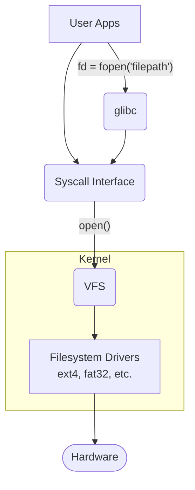

# Linux File System Essentials

In this file, we will explain the essentials of the Linux file system.

---
## In Linux, everything is a file.

### What is a file system?

A file system is:

- The way your system organizes and deals with data on the hard disk.
    
- The directory structure containing the main files in the system.
    

### What are storage devices?

- **Floppy Disk:** Magnetic disk, 32 MB
    
- **Flash memory:** Floating gate MOSFET
    
- **Hard disk:** Magnetic disk, TB 2TB
    
- **CD ROM:** Laser Engravings
    

---
## Internal vs. External Fragmentation

### External Fragmentation

This is what is commonly referred to as fragmentation. It is when a single file is stored in many non-contiguous (separate) pieces on a storage device because there isn't a single free block of space large enough to hold it. This creates unused gaps _between_ files.

**Why does it happen?**

It occurs naturally over time as you create, modify, and delete files. The operating system tries to fill the empty gaps left by deleted files. If a new file is too large for a single gap, it gets split into multiple pieces.

**What's the problem with it?**

For traditional Hard Disk Drives (HDDs), which have physical moving parts, fragmentation can significantly slow down performance. The disk's read/write head must physically move to different locations on the disk to read a single file, which takes much more time than reading the file from one continuous block.

**Is it a problem on Linux?**

Generally, no. Modern Linux file systems like `ext4` are designed to proactively avoid fragmentation. They do this by leaving space between files and using intelligent allocation strategies. While fragmentation can technically still occur, it rarely becomes a performance issue, so you almost never need to "defragment" a Linux system.

### What is Internal Fragmentation?

Internal fragmentation occurs when storage space is wasted _inside_ an allocated block. File systems allocate space in fixed-size units called blocks (e.g., 4096 bytes). If a file's size is not an exact multiple of the block size, the last block will have unused space.

For example, if the block size is 4KB and you save a 1KB file, that file will be allocated a full 4KB block. The remaining 3KB is wasted space. This wasted space is called internal fragmentation because it is internal to an allocated region.

---
## What is an Inode?

An **inode** (index node) is a data structure on the file system that stores all the metadata about a file or directory, except for its name and its actual content. When a file is created, it is assigned both a name and an inode number.

The inode acts as a "table of contents" entry for a specific file, containing information such as:

- **Inode ID:** A unique number identifying the inode.
    
- **File Type:** Whether it is a regular file, directory, symbolic link, etc.
    
- **Size:** The size of the file in bytes.
    
- **Permissions:** Read, write, and execute permissions for the owner, group, and others.
    
- **Pointers:** Addresses that point to the actual data blocks on the hard disk where the file's content is stored.
    
- **Timestamps:** Time of last access, modification, and inode change.
    
- **Owner/Group:** The User ID and Group ID of the file's owner.
    

### Inode Structure in the Linux Kernel

At a technical level, the inode is represented by a C structure (`struct inode`) within the Linux kernel. This structure contains fields that correspond directly to the metadata mentioned above. Some key fields from this structure include:

- `i_mode`: Stores the file type and permissions (read, write, execute).
    
- `i_uid` and `i_gid`: Store the User ID and Group ID of the owner.
    
- `i_size`: Stores the file's size in bytes.
    
- `i_atime`, `i_mtime`, `i_ctime`: Timestamps for last access, modification, and status change.
    
- `i_blocks`: The number of disk blocks allocated to the file.
    

```c
struct inode {
    umode_t			i_mode;         /* File mode (permissions) */
    unsigned short		i_opflags;      /* Internal flags */
    kuid_t			i_uid;          /* Owner's user ID */
    kgid_t			i_gid;          /* Owner's group ID */
    unsigned int		i_flags;        /* File flags */
    struct timespec64	i_atime;        /* Last access time */
    struct timespec64	i_mtime;        /* Last modification time */
    struct timespec64	i_ctime;        /* Last status change time */
    blkcnt_t		i_blocks;       /* Number of 512B blocks allocated */
    loff_t			i_size;         /* File size in bytes */
    struct hlist_node	i_hash;         /* Hash list node */
    struct list_head	i_io_list;      /* IO list */
    struct list_head	i_wb_list;      /* Write-back list */
    struct address_space	*i_mapping;     /* Page cache mapping */
    struct address_space	i_data;         /* Private data mapping */
    struct inode_operations	*i_op;          /* Inode operations */
    struct super_block	*i_sb;          /* Associated superblock */
    struct file_operations	*i_fop;         /* File operations */
    struct lockref		i_lockref;      /* Reference count with spinlock */
    atomic_t		i_count;        /* Reference counter */
    unsigned int		i_state;        /* State flags */
    dirmtime_t		dirtied_when;   /* Time when dirtied */
    unsigned long		i_version;      /* Version number */
    u32			i_generation;   /* Generation number */
    struct xattr		*i_xattrs;      /* Extended attributes */
};
```

---
## What is Metadata?

Metadata is simply "data about data." In the context of a file system, the actual content of a file (the text in a document, the pixels in an image) is the **data**. The **metadata** is all the other information that describes that file. Essentially, all the information stored in an inode is the file's metadata.

---
## How Filenames and Inodes are Connected: The Dentry

While the inode stores _what_ the file is, it doesn't store the file's human-readable name. This is handled by directories.

A directory is a special type of file that contains a list. This list maps filenames to inode numbers. Each of these mappings is called a **directory entry** or **dentry**.

When you access a file like `file.txt`, the system:

1. Looks inside the current directory file.
    
2. Searches the list of dentries for the name `file.txt`.
    
3. Finds the corresponding inode number (e.g., 36421).
    
4. Uses that number to locate the inode, which then points to the file's actual data.
    

### Dentry Table Structure

The dentry itself is a structure that contains several key pieces of information to manage the file system hierarchy efficiently. The system maintains a dentry cache to speed up the process of translating paths to inodes.

- **Dentry Name:** The actual filename (e.g., `passwd`).
    
- **Inode Number:** The inode number that this name points to.
    
- **Parent Dentry:** A reference to the dentry of the parent directory.
    
- **Child Dentries:** A list of child dentries if the entry is a directory.
    
- **Reference Count:** Tracks how many times the dentry is currently being used by the system.
    

Here is an example of a dentry for the file `/etc/passwd`:

|Field|Value|
|---|---|
|Dentry Name|`passwd`|
|Inode Number|`128394`|
|Parent Dentry|`/etc`|
|Child Dentries|None (since it is a file)|
|Reference Count|`3`|

----
## Understanding the Superblock

### What is a Superblock?

The **superblock** is a critical metadata structure in Linux filesystems that contains information about the filesystem as a whole. It holds essential data required for the filesystem's operation, including its size, status, and configuration parameters.

### Key Concepts

- **Filesystem Metadata:** The superblock stores metadata that describes the filesystem's properties.
    
- **Recovery and Redundancy:** Multiple copies of the superblock may exist to ensure recovery in case of corruption.
    
- **Dynamic Information:** The superblock may track dynamic information like free blocks and inodes.
    

### Superblock Structure

The superblock typically includes the following fields:

|Field|Description|Example Value|
|---|---|---|
|Magic Number|Identifies the filesystem type|`0xEF53` (for ext2/ext3/ext4)|
|Filesystem Size|Total size of the filesystem in blocks|`1000000` blocks|
|Block Size|Size of each block in bytes|`4096` bytes|
|Free Blocks|Number of free blocks available|`50000`|
|Free Inodes|Number of free inodes available|`20000`|
|Mount Count|Number of times the filesystem has been mounted|`50`|
|Maximum Mount Count|Number of mounts before a filesystem check is needed|`100`|
|Filesystem State|Current state (clean, errors detected, etc.)|`Clean`|
|Last Mount Time|Timestamp of the last mount|`2024-04-10 12:34`|
|Last Write Time|Timestamp of the last write|`2024-04-15 08:21`|
|UUID|Universally Unique Identifier for the filesystem|`123e4567-e89b-12d3-a456-426614174000`|
|Volume Name|Human-readable name for the filesystem|`MyData`|
|Journal UUID|UUID of the journal (if journaling is enabled)|`abcdef01-2345-6789-abcd-ef0123456789`|

----
## The Virtual File System (VFS)

The **Virtual File System** (also known as the Virtual Filesystem Switch or VFS) is a crucial abstraction layer inside the Linux kernel. Its primary purpose is to allow user applications to interact with different types of filesystems in a uniform way.

Because of the VFS, a programmer can use standard system calls like `open()`, `read()`, `write()`, and `close()` on any file, and the application doesn't need to know or care whether the underlying filesystem is `ext4`, `fat32`, `NTFS`, or a network filesystem like `NFS`.

### How it Works

The VFS provides a common interface for all filesystems. When a user application makes a file-related system call:

1. The call goes through a standard library (like `glibc`) to the kernel's system call interface.
    
2. The kernel then directs the call to the VFS.
    
3. The VFS **detects the needed filesystem** to perform the operation.
    
4. It **loads this filesystem driver** into RAM if it's not already loaded.
    
5. It then **translates the generic system call** into the specific function that the underlying filesystem's driver can understand.
    
6. The filesystem driver **performs the operation** by interacting with the hardware.
    

This abstraction makes the system incredibly flexible, allowing you to mount and use various storage devices with different formats seamlessly.



----
## Block Size Trade-offs: Small vs. Large

The choice of block size for a filesystem involves a trade-off between space efficiency and I/O performance.

|Feature|Large Block Size|Small Block Size|
|---|---|---|
|**Fragmentation**|More internal fragmentation (wasted space)|Less internal fragmentation (more space efficient)|
|**I/O Requests**|Fewer Read/Write requests for large files (faster)|More Read/Write requests for large files (slower)|
|**Error Recovery**|Inefficient: the entire large block must be resent.|Efficient: only the small block needs to be resent.|
|**Transmission Time**|Slower transmission per block.|Faster transmission per block.|

## Useful Commands

Here are some commands to inspect filesystem information.

### `lsblk -f`

This command lists all available block devices (like hard drives and their partitions). The `-f` or `--fs` flag adds filesystem information to the output, showing you details like the filesystem type (`FSTYPE`), `UUID`, and `MOUNTPOINT`. This is very useful for getting a quick overview of your storage layout.

### `blockdev --getbsz`

This command is used to get the block size of a specific block device in bytes. You need to provide the path to the device. Because it inspects low-level device properties, it usually requires `sudo`.

**Example:**

```bash
sudo blockdev --getbsz /dev/sda
```

This command will return the block size (e.g., `4096`) for the device `/dev/sda`.

---
## Standard File Descriptors

Every process in Linux starts with three standard file descriptors automatically opened by the kernel:

- **0 (stdin):** Standard input, typically connected to the keyboard or terminal for reading input.
    
- **1 (stdout):** Standard output, typically connected to the display or terminal for normal program output.
    
- **2 (stderr):** Standard error, typically connected to the display or terminal for error messages and diagnostic output.
    

---
## Common File Operations

The behavior of common file operations depends heavily on the underlying filesystem structures like inodes and dentries.

### Copying a File

When you copy a file, the system always creates a brand new, independent file at the destination. This process is the same whether you are copying to the same filesystem or a different one.

- **A new inode is created** on the destination filesystem.
    
- **New data blocks are allocated**, and the original data is read and written to these new blocks.
    
- **A new dentry is created** in the destination directory to link the new filename to the new inode.
    
- Metadata like permissions may be preserved, but the creation timestamp and inode number will be new.
    

### Moving a File

The `mv` command is more complex, as its behavior changes based on the source and destination.

#### Within the Same Filesystem

This is a very fast, efficient operation because no actual file data is moved. It is purely a metadata operation.

- **Changes:** A new **dentry** is created in the destination directory and the old one is removed from the source. Both dentries point to the _exact same inode_.
    
- **Constant:** The **inode number**, the **data blocks**, and all metadata (like permissions and timestamps) remain unchanged. You are simply changing where the filename points.
    

#### To a Different Filesystem

When you move a file to a different partition or drive (a different filesystem), the operation is fundamentally a **copy-then-delete**. An inode from one filesystem cannot exist on another.

- **Changes:** The system first performs a full **copy** operation to the new filesystem, creating a new inode, new data blocks, and a new dentry.
    
- Once the copy is successfully verified, the original dentry, inode, and data blocks on the source filesystem are **deleted**. This is a much slower process because all the file's data must be read from the source and written to the destination.
    

### Renaming a File

Renaming a file is identical to moving a file **within the same filesystem**. It is a very fast metadata-only operation.

- **Changes:** The text of the **dentry** (the filename) is changed.
    
- **Constant:** The **inode number** and the **data blocks** are completely untouched. The file itself hasn't changed, only the name used to find it.
    

### Deleting a File

When you delete a file (using `rm`), you are not immediately erasing the data from the disk.

- **The dentry is removed** from the directory file. This unlinks the filename from its inode.
    
- The system checks the **link count** on the inode. If this was the only link (the link count is now zero), the inode and its associated data blocks are marked as free in the filesystem's bitmaps.
    
- The data is not wiped. It remains on the disk until the system reallocates those data blocks for a new file and overwrites them. This is why deleted files can sometimes be recovered with special tools.
    

---
## Advanced Filesystem Commands

Here are some more advanced commands for inspecting filesystem details.

### View a file's inode number

Use the `-i` flag with `ls` to display the inode number as the first column in the output.

```bash
ls -i file.txt
```

### View inode usage for filesystems

Use `df -ih` to see how many inodes are used and how many are free on each mounted filesystem. This is useful for diagnosing "no space left on device" errors that can occur even when disk space is available, if all inodes have been used.

```bash
df -ih
```

### View detailed filesystem metadata

The `dumpe2fs` command prints the super block and blocks group information for filesystems of the ext2, ext3, or ext4 type. It provides a huge amount of detailed information. It's often piped to `grep` to find specific fields.

**Note:** This command requires `sudo` and the correct path to your partition, which may be different from the example.

```bash
sudo dumpe2fs /dev/nvme1n1p5 | grep "Filesystem created:"
```